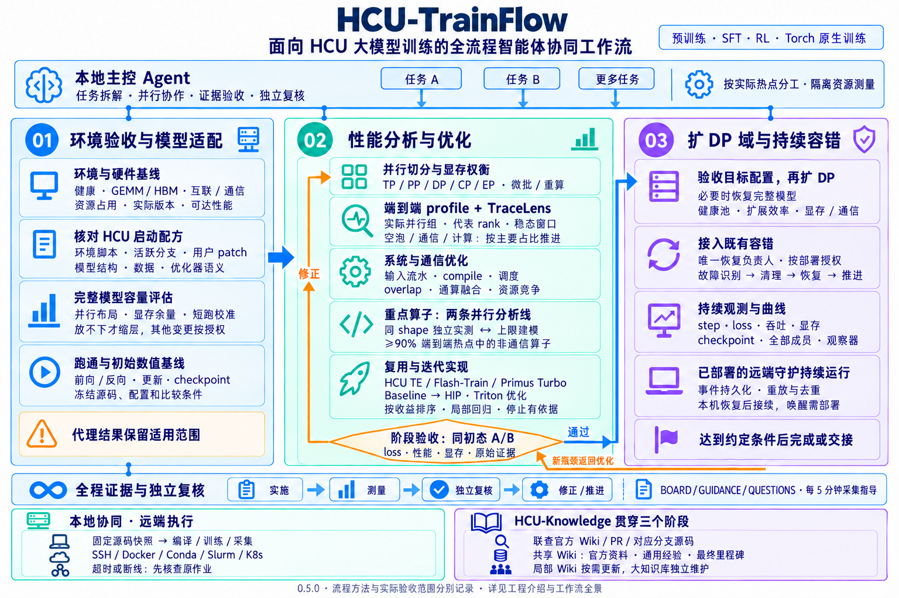

# HCU-TrainFlow

## 面向 HCU 大模型训练的全流程智能体协同工作流

An agentic workflow for end-to-end large-model training adaptation, optimization, and resilient scaling on HCU.

给出模型、环境和目标，由本地主控 Agent 协调适配、分析与优化、扩容验证及长训容错。每轮以实际证据推进，经过独立复核和修正；人在看板中补充意见，Agent 读取、回复并调整后续工作。适用于预训练、SFT、RL，以及 Torch 原生的视频生成、VLA、世界模型等训练，也支持只检查环境、只分析性能或只诊断故障。

**当前版本：`0.5.1`。** 已结合真实 SSH + Docker HCU 环境验证固定快照执行、代理模型训练、多 rank 性能分析、代表性算子迭代和有界跨节点恢复；主控接手、阶段交接及工具逻辑有本地回归。新站点、完整模型收敛、长期告警/Agent 自动唤醒仍须分别验收。见 [能力与验证边界](docs/capabilities.md)。

**首次了解工程，建议阅读 [HCU-TrainFlow 工程介绍](docs/project-overview.md)**：从接到一个新模型和环境开始，讲清三个阶段如何推进、如何选择优化对象、怎样保护训练质量，以及多 Agent、知识检索和持续守护如何配合。

## 如何开始

安装后，在支持 Skill 的 Agent 中说：

> `$hcu-trainflow` 在我提供的环境中，对指定模型进行适配、性能优化和大规模验证。已有启动脚本、数据路径和资源范围如下……

主控先按[接手与阶段交接指南](docs/agent-playbook.md)确认现场、任务范围与已有证据，再调用当前阶段 Skill，按主要瓶颈推进。安装会给 Skill 保存本机工程位置；换目录开新任务也可定位，任务 workspace 与资源权限仍单独确认。

主控会建立任务、确认缺失的关键条件，然后按阶段推进。已知环境和授权可以复用；正常步骤持续执行，遇到权限缺口、数值异常、收益平台期或需要专家判断时再提出具体问题。内部任务文件和命令由 Agent 管理。

## 工作流总览

[](docs/assets/workflow-overview.png)

[工程介绍](docs/project-overview.md) · [详细流程图与验收规则](docs/workflow-map.md)

### 1. 环境验收与模型适配

- **发现并验收现场**：确认节点与卡的授权、占用、拓扑、镜像、DTK 和关键库版本，复用当前 Cluster Manager、run_nhc、检查脚本及 DTK 工具。检查健康、GEMM、HBM、机内互联和机间通信，逐项对照有来源的预期；缺项、性能差距和排查结果明确记录，需要时请专家介入。
- **准确适配模型**：选择适用且活跃的 HCU 仓库/分支，优先核对已有启动脚本、环境变量和现场激活链；结合官方实现确认模型结构、数据、精度、优化器与训练语义，保留用户 patch 和执行基线。预训练、SFT、RL 与 Torch 原生训练分别补查其数据和执行语义。
- **先评估完整模型容量**：参考 HCU Train Sim、当前模型源码、实际可用卡数和硬件参数，预算最重 rank 的显存与余量并短跑校准。能放下就直接全参适配；资源不足才优先缩 layer，其他维度变化须明确授权并记录代理范围。
- **建立可信基线**：验证前向、反向、参数更新和 checkpoint，冻结源码、配置、初始数值及比较条件。有 NVIDIA 环境时补充跨平台对照；未覆盖范围保留到后续验收。

### 2. 性能分析、优化与质量验证

- **并行切分与显存取舍**：先评估 TP/PP/DP/CP/EP、微批、累积、重算、状态切分及 overlap，在显存峰值、必要余量、通信和实际吞吐之间选择配置。调参保持训练语义可比，GPU_MAX_HW_QUEUES 等按当前 runtime 与实测核验。
- **按主要瓶颈推进**：采集稳态端到端 profile，每个实际非单例并行组至少覆盖两个代表 rank，结合 TraceLens 分析空泡、通信、负载不均、计算和显存。谁占主要时间就先处理谁；通信达到单测预期仍大量暴露时，再考虑 overlap、调度或通算融合。
- **重点算子持续迭代**：对累计 ≥90% 端到端热点中的非通信算子，按实际贡献排序，评估瓶颈、可达上限、当前效率和剩余空间。同 shape 独立实测与上限建模可以并行，用于区分实现差距和模型内资源竞争；保留空泡、重叠和未归因时间的正确口径。
- **复用与深入实现**：优先复用 HCU TE、Flash-Train、Primus Turbo 等能力，对齐融合粒度和数值契约；缺 HIP 基线时先调用 baseline Skill，再进入 HIP 优化，已有 Triton 实现调用 Triton 优化 Skill。融合后仍有显著空间就继续迭代，瓶颈时使用实际性能工具；数学库有性能缺口时提取原生日志中的完整 bench 命令用于 tune。通信按需联动 RCCL、rocSHMEM、DeepEP、UCCL、UltraEP、MoonEP 等。
- **稳定阶段验 loss**：每轮做局部正确性、多形状和无 profiler 性能回归，集成后重测整步净收益；稳定阶段从同一冻结初态与配方比较 loss、性能和显存。达到目标、接近可达上限、无稳定收益或受阻，都须给出证据与停止依据。

同一阶段包含 [Torch 原生训练专项](skills/hcu-train-optimize/references/torch-native-training.md) 和 [通信优化专项](skills/hcu-train-optimize/references/communication-optimization.md)，覆盖输入流水、autograd、compile/断图/重编译、DDP/FSDP，以及 bucket/chunk、同步、overlap、通算融合和资源竞争。机制选择联查官方教程与 PR、AMD Primus、MindSpeed 系列、LoongForge 和 HCU 底层源码。详见[热点排序与算子迭代](skills/hcu-train-optimize/references/operator-ceiling-iteration.md)。

### 3. 扩 DP 域、容错与持续训练

- **逐级扩容**：完整模型目标必要时先恢复并验收完整配置；获准的代理任务可以扩选定代理配置的 DP，并保留完整模型验证缺口。以 Cluster Manager 为主筛机、交叉检查疑似节点并维护健康池，逐级核对吞吐、扩展效率、通信、显存和训练语义；新瓶颈返回优化。
- **验证恢复链路**：接入现场既有容错并明确唯一恢复负责人，按部署授权诊断卡住、core dump、OOM、泄露等问题。验证旧进程处理、checkpoint 完整性、重新拉起及训练状态恢复，观察 step 是否真实持续推进。
- **长时观察与接续**：持续记录 loss、吞吐、显存、全部必需成员、checkpoint 和恢复状态，生成曲线并检查观察器自身健康。本机离线时由已部署并验收的远端守护和既有容错继续工作；恢复后核对现场、重放事件并接续 Agent，告警和自动唤醒分别验收。

### 贯穿全程的协同与交付

本地主控按依赖和收益拆解任务，独立方向并行，共享资源测量与耦合修改协调执行；代码以固定快照同步远端，超时或断线先核查原作业。HCU-Knowledge、局部官方 Wiki、PR 与源码查证贯穿三个阶段，看板持续展示技术结论并采集指导。各阶段按范围交付代码、配方、验证和回退方法；完整任务在执行基线上完成约定验证后再整合目标主仓，精选通用经验和最终里程碑进入共享 Wiki。

阶段入口分别为 `$hcu-train-environment-check-and-adapt`（环境检查与模型适配）、`$hcu-train-optimize`（性能分析与优化）、`$hcu-train-scale-and-stability`（规模扩展与长稳运行）；统一委托仍使用 `$hcu-trainflow`。发生异常时按 [故障诊断指南](skills/hcu-train-scale-and-stability/references/diagnosis.md) 分流，结合 HCU 知识库、线上 PR 与实际源码查证，修复后回到对应阶段验收。

完整分支、优化回路、独立任务与验收条件见 [工作流全景](docs/workflow-map.md)。

## 如何与 Agent 协作

每个任务在私有工作区生成：

```text
collaboration/<task>/BOARD.md       进度、待决问题、轮次复核和证据入口
collaboration/<task>/GUIDANCE.md    人的评论、回答和优先级调整
collaboration/<task>/QUESTIONS.md   问题、Agent 回答和追问
```

在 `GUIDANCE.md` 写意见，默认每 **5 分钟**采集一次；主控在后续实验与推进前检查已采集的指导并记录处理结果。需要立即生效时可让 Agent 刷新，或运行 `flow-board` / `flow-watch --once`。文件轮询本身不运行模型。会话关闭后的自动接续需要部署 Agent bridge；本机离线时，已部署并验收的远端守护和原有容错继续运行。详见 [协作循环与文件交互](docs/collaboration.md) 和 [长训守护](docs/operations.md)。

解释性问题可写入 `QUESTIONS.md`，主控按同一周期读取并在原问题下回答，保留问题与回答版本。问题不自动改变资源或重启授权；采集器不会代替离线的 Agent 生成答案。

主控在同一周期检查已登记的可重建缓存，默认只生成清理计划；明确启用的部署策略可自动保留最近3代并清理过期代次，活跃作业与证据继续保护，老目录不会自动删除。模型/实验 context 换代时使用独立观察 Store，重新核对全部成员监测及独立 sentinel。见 [工作区维护与观察交接](docs/workspace-maintenance.md)。

## 多 Agent 如何协同

主控根据模型与实测热点动态生成任务和 Agent 分工，不预设固定算子名单。环境与启动配方核对、系统分析，以及不同算子的详细分析和优化均可并行；某个算子具备实施条件后即可优化，无需等待其他算子的分析全部完成。相关 Agent 可提问、答复、共享发现和报告阻塞，消息与处理回执保存在同一任务中。

卡数充足时，也可用多个隔离的完整模型最小可行 DP 实例并行验证不同优化方向，公共基线与质量契约保持一致，Agent 及时互通进展，由主控复验并集成兼容结果。见[容量预估与并行实验](docs/practices/capacity-and-parallel-experiments.md)。

下游只消费已验收的结果；共享 GPU 的测量、耦合代码修改、集成和阶段 loss 验证由主控安排。任务领取、真实 Agent 会话、返回报告和验收分别记录，避免重复派发或把“已经返回”误当成“已经完成”。详见 [任务拆解与 Agent 协同](docs/multi-agent.md)。

## 知识如何参与工作流

**HCU-Knowledge 是完整安装的必需组成，贯穿三个阶段。** 按问题检索硬件、工具、HCU 工程、配方、优化与故障案例，并联查私有训练经验和官方引擎 Wiki；本地证据不足时继续在线搜索 PR、阅读讨论并追到对应版本的源码和底层依赖。必需安装不表示每个命令都强制查询。

局部官方 Wiki 可按问题和版本变化自主更新，并联动复核相关 Skill、命令与解析器用法；普通查询或训练任务不附带更新 HCU-Knowledge，也不会自动替换正在运行的训练依赖。共享 Wiki 只收录官方资料、跨项目可复用的环境经验，以及模型最终优化里程碑的总结和关键数据。环境经验放 `knowledge/sites/`，最终总结放 `knowledge/experiments/`，必要证据随仓提交。中间候选、调参试验和临时排查留在 workspace 与看板；外部 Cookbook 的发布要求单独处理。参见 [知识归属与跨任务复用](docs/knowledge-architecture.md)。详见 [知识检索与维护](docs/wiki.md) 和 [训练经验记录](docs/experience-knowledge.md)。

性能分析的证据刷新、热点/重叠/融合三表、上限判读、组合验证与停滞处理，见 [性能方法与参考来源](docs/practices/performance-methods.md)。故障调查沿各阶段 Skill 共用的诊断指南推进，结合 HCU 大知识库和当前源码持续查证。

## 安装

Python 3.10+、Git、Git LFS，以及 HCU-Knowledge 仓库读取权限。使用 SSH/Docker/Slurm/K8s 时需对应客户端与资源权限；HCU 训练软件由实际环境提供。

```bash
git clone https://github.com/yuguo-Jack/HCU-TrainFlow.git
cd HCU-TrainFlow
git lfs install
```

PowerShell 中完成依赖、知识库本机索引和 **11 个 Skill** 的安装（六个 TrainFlow、三个算子、两个 HCU 知识库）：

```powershell
python scripts/setup_trainflow.py --skills-dir "$HOME/.codex/skills"
$env:TRAINFLOW_PROJECT = (Get-Location).Path
$env:TRAINFLOW_WORKSPACE = "D:/trainflow-work/my-task"
```

已有独立知识库时加 `--knowledge-root /path/to/HCU-Knowledge`，复用原件、索引与配置，不重复克隆、不拉取其上游更新。缺少私有仓权限、LFS 原件或索引不可用时安装会报告未完成；不会静默跳过。飞书等在线能力另用本人账号授权。详见 [依赖与安装说明](docs/integrations.md)。

### 后续更新

日常维护使用 `$hcu-engine-wiki-skill-update`，由 Agent 检查官方与相关 HCU 工程变化，更新局部 Wiki、受影响的流程和 Skill，验证后同步本机安装。普通维护不更新 HCU-Knowledge，也不自动替换正在运行的训练依赖。

手动拉取 TrainFlow 新版本后，可重新运行安装命令并加 `--replace`。这个参数只允许用已经核对的仓库内容替换本机已安装 Skill；内容查证与修订由更新 Skill 完成。安装器在全部内容及目录绑定校验成功后清理本次临时旧版本备份，失败时保留备份供恢复。完成后重新打开 Agent 会话。具体步骤见[维护与本机同步](docs/integrations.md#skills账号与升级)。

## 本地验证与阅读入口

```bash
hcu-trainflow --version
python -m pip install -e ".[test]"
hcu-trainflow collaboration-demo .work/collaboration-first
hcu-trainflow demo .work/analysis-first
python -m pytest -q
python scripts/validate_knowledge.py
```

两个 demo 使用合成输入，分别演示协作协议和训练分析/监测；不需要 GPU，不构成真实训练验证。每次演示使用新目录。

| 目录 | 内容 |
| --- | --- |
| `skills/` | 统一协作入口、阶段流程和 Wiki 检索/更新 |
| `src/hcu_trainflow/` | 持久任务、复核循环、执行与证据、分析和监测 |
| `knowledge/` | 官方训练引擎与生态 Wiki、固定来源、维护关联 |
| `docs/` | 协作约定、安装、契约、部署及验证说明 |
| `examples/`、`tests/` | 合成示例与本地回归 |
| `thirdparty/` | 依赖清单和忽略提交的工具 checkout |

任务源码、完整日志/trace/checkpoint、数据与看板保存在独立 workspace；默认 `.work/` 忽略提交。工程 Wiki 仅包含官方资料、可复用环境经验和模型最终优化总结；工作流方法在 docs/skills，过程记录不进入 Wiki；凭据、私钥和 token 不入仓。

- [工程介绍](docs/project-overview.md) / [工作流全景](docs/workflow-map.md) / [协作循环](docs/collaboration.md) / [多 Agent 协同](docs/multi-agent.md) / [三个阶段工作流](docs/workflows.md)
- [快速开始与 CLI](docs/quickstart.md) / [架构](docs/architecture.md)
- [性能分析](docs/profiling.md) / [远程执行](docs/remote-execution.md)
- [真实训练观察](docs/training-observation.md) / [离线训练图表](docs/training-dashboard.md) / [缓存维护与观察换代](docs/workspace-maintenance.md)
- [官方 Wiki](knowledge/README.md) / [搜索与更新](docs/wiki.md) / [私有训练经验与 Cookbook 记录](docs/experience-knowledge.md)
- [贡献与公开边界](CONTRIBUTING.md) / [参考工程](THIRD_PARTY_NOTICES.md)
