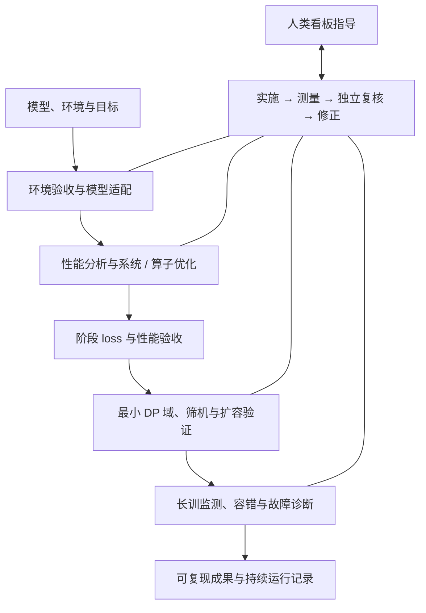

# HCU-TrainFlow

## 面向 HCU 大模型训练的全流程智能体协同工作流

An agentic workflow for end-to-end large-model training adaptation, optimization, and resilient scaling on HCU.

给出模型、环境和目标，由本地主控 Agent 协调适配、分析与优化、扩容验证及长训容错。每轮以实际证据推进，经过独立复核和修正；人在看板中补充意见，Agent 读取、回复并调整后续工作。适用于预训练、SFT 和 RL，也支持只检查环境、只分析性能或只诊断故障。

**当前源码版本：`0.4.0.dev0`，开发中，尚未发布。** 协作循环、证据检查和文件交互已有本地自动化验证；真实 HCU 训练、Agent 运行时接续及站点容错仍需逐项联调。当前不能视为拿到任意集群就可无人值守运行的成品。见 [能力与验证边界](docs/capabilities.md)。

## 如何开始

安装后，在支持 Skill 的 Agent 中说：

> `$hcu-trainflow` 在我提供的环境中，对指定模型进行适配、性能优化和大规模验证。已有启动脚本、数据路径和资源范围如下……

主控会建立任务、确认缺失的关键条件，然后按阶段推进。已知环境和授权可以复用；正常步骤持续执行，遇到权限缺口、数值异常、收益平台期或需要专家判断时再提出具体问题。内部任务文件和命令由 Agent 管理。



优化保持初始数值基线；逐轮做局部正确性和性能回归，稳定阶段再验 loss。对累计 ≥90% 端到端热点中的非通信算子评估上限与效率。优先复用当前 HCU 工程配方和已有融合实现，必要时参考官方引擎 Wiki、HCU-Knowledge、底层源码及三个 Hygon 算子 Skill。

## 如何与 Agent 协作

每个任务在私有工作区生成：

```text
collaboration/<task>/BOARD.md       进度、待决问题、轮次复核和证据入口
collaboration/<task>/GUIDANCE.md    人的评论、回答和优先级调整
```

在 `GUIDANCE.md` 写意见，默认每 **5 分钟**采集一次；主控在后续实验与推进前检查已采集的指导并记录处理结果。需要立即生效时可让 Agent 刷新，或运行 `flow-board` / `flow-watch --once`。文件轮询本身不运行模型。会话关闭后的自动接续需要部署 Agent bridge；本机离线时远端守护和原有容错继续运行。详见 [协作循环与文件交互](docs/collaboration.md) 和 [长训守护](docs/operations.md)。

## 多 Agent 如何协同

主控根据模型与实测热点动态生成任务和 Agent 分工，不预设固定算子名单。环境与启动配方核对、系统分析，以及不同算子的详细分析和优化均可并行；某个算子具备实施条件后即可优化，无需等待其他算子的分析全部完成。相关 Agent 可提问、答复、共享发现和报告阻塞，消息与处理回执保存在同一任务中。

下游只消费已验收的结果；共享 GPU 的测量、耦合代码修改、集成和阶段 loss 验证由主控安排。任务领取、真实 Agent 会话、返回报告和验收分别记录，避免重复派发或把“已经返回”误当成“已经完成”。详见 [任务拆解与 Agent 协同](docs/multi-agent.md)。

## 安装

Python 3.10+、Git；使用 SSH/Docker/Slurm/K8s 时需对应客户端与资源权限。HCU 训练软件由实际环境提供。

```bash
git clone https://github.com/yuguo-Jack/HCU-TrainFlow.git
cd HCU-TrainFlow
python -m pip install -e ".[test]"
python scripts/bootstrap_thirdparty.py
python -m pip install -e thirdparty/TraceLens
```

PowerShell 中安装一个统一入口、三个阶段 Skill、两个 Wiki Skill，以及三个 Hygon 算子 Skill：

```powershell
python scripts/install_skills.py --with-kernel-skills --target "$HOME/.codex/skills"
$env:TRAINFLOW_PROJECT = (Get-Location).Path
$env:TRAINFLOW_WORKSPACE = "D:/trainflow-work/my-task"
```

升级使用 `--replace`，旧版本先备份到 Skill 扫描目录之外；旧名 `hcu-train-prepare`、`hcu-train-operate` 会迁移为 `hcu-train-adapt`、`hcu-train-fault-tolerance`。省略 `--with-kernel-skills` 只安装六个 TrainFlow Skill。TraceLens 使用固定版本的 HCU fork；HCU-Knowledge 按权限单独启用或复用已有安装，默认不会拉取私有知识。见 [依赖与安装说明](docs/integrations.md)。

## 本地验证与阅读入口

```bash
hcu-trainflow --version
hcu-trainflow collaboration-demo .work/collaboration-first
hcu-trainflow demo .work/analysis-first
python -m pytest -q
python scripts/validate_knowledge.py
```

两个 demo 使用合成输入，分别演示协作协议和训练分析/监测；不需要 GPU，不构成真实训练验证。每次演示使用新目录。

| 目录 | 内容 |
| --- | --- |
| `skills/` | 统一协作入口、阶段流程和 Wiki 检索/更新 |
| `src/hcu_trainflow/` | 持久任务、复核循环、执行与证据、分析和监测 |
| `knowledge/` | 官方训练引擎与生态 Wiki、固定来源、维护关联 |
| `docs/` | 协作约定、安装、契约、部署及验证说明 |
| `examples/`、`tests/` | 合成示例与本地回归 |
| `thirdparty/` | 依赖清单和忽略提交的工具 checkout |

任务源码、现场数据、日志、看板与凭据保存在独立私有工作区；默认 `.work/` 同样忽略提交。公共仓仅包含可复用流程、工具、公开知识及合成示例。

- [协作循环](docs/collaboration.md) / [多 Agent 协同](docs/multi-agent.md) / [三个阶段工作流](docs/workflows.md)
- [快速开始与 CLI](docs/quickstart.md) / [架构](docs/architecture.md)
- [性能分析](docs/profiling.md) / [远程执行](docs/remote-execution.md)
- [官方 Wiki](knowledge/README.md) / [搜索与更新](docs/wiki.md) / [私有训练经验与 Cookbook 记录](docs/experience-knowledge.md)
- [贡献与公开边界](CONTRIBUTING.md) / [参考工程](THIRD_PARTY_NOTICES.md)
