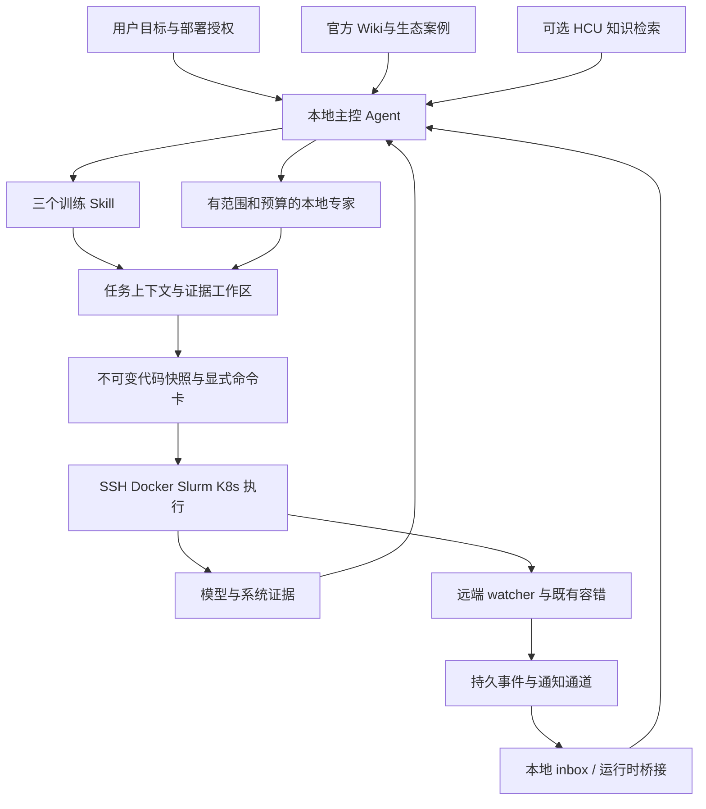

# 架构与边界

## 任务状态与证据

TaskSpec 保存模式、目标、context、权限、预算和 recovery_owner。context 是比较队列的身份，应包含初始基线与候选锁、模型、数据、环境和验证契约。变化后旧证据仍可读，但状态回到 prepared，旧报告不能直接用于当前门槛。

full 模式按 prepared→environment_checked→baseline_validated→profiling→optimizing→scale_ready→training→completed 推进；中断状态需说明原因。独立 analyze/environment/diagnose 模式可以交付“不充分或不通过”的报告，但不会把它当作训练准入。

SQLite 保存任务、报告、事件、租约、操作和游标；大对象按 SHA256 存储。写入事件与 outbox 同事务。资源 fencing token 防止过期控制者继续发新命令；未明结局的执行阻止该资源重新取得执行权，必须先 reconcile。

## 执行边界

命令卡显式提供 argv、cwd、env、backend、timeout 和来源依据，默认不执行未授权命令。执行意图先持久化，stdout/stderr 写文件；超时、控制器崩溃或 SSH 断线不能简单认定远端已终止，操作进入待核对状态。

这不是权限沙箱，也无法约束任意外部 shell 或另一个控制器。部署依赖 OS/调度器隔离及统一的资源 ID，不能以 Python 租约替代真实资源管理。

## 数据隔离

公共 checkout：源码、公开 Wiki、示例和测试。私有工作区：site、任务、源镜像、开发 worktree、运行快照、数据指纹、日志、报告、事件与通知配置。模型权重与数据集在站点管理的存储，不加入 bundle。

## Agent 与长训

主控通过 assignment 划分分析/实现范围并验收，不在库内绑定某家模型 API。远端只需 Python watcher 和原有容错工具。Agent bridge 在本机运行，可接站点/用户自己的 Codex CLI launcher；bridge 退出成功仅表示交付返回，事件仍需消费者完成回执。
