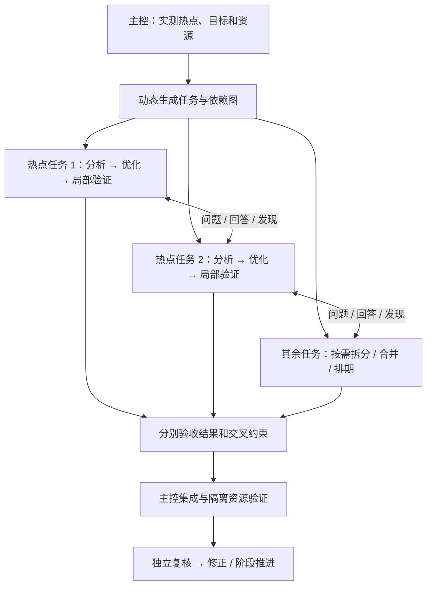

# 任务拆解与 Agent 协同

统一入口负责目标、优先级、阶段推进和结果集成。它先判断哪里值得并行，再把有明确输入、边界与验收的任务交给专家。模型推理由本地主控和宿主支持的 Agent 会话承担；远端执行编译、训练、测量和守护。

TrainFlow 保存依赖、工作占用、会话映射、消息和证据。`team-next` 给出当前可派发集合，主控通过宿主原生多 Agent 工具启动实际会话。CLI 的领取不会自行启动模型；没有可用委派能力时主控顺序执行，并如实记录。

## 哪些环节可以并行

| 阶段 | 可拆的工作 | 汇合点与限制 |
| --- | --- | --- |
| 环境与适配 | 拓扑/健康记录；HCU 当前启动配方；官方模型语义和用户 patch；软件依赖核对 | 共享环境事实。实际 GEMM/HBM/通信基准按资源隔离执行；环境验收、配方整合后再跑模型 |
| 端到端分析 | 固定 trace 上的 CPU/空泡、通信/并行域、显存、算子/shape/上限建模 | 使用同一采样窗口、rank 映射和墙钟分母。TraceLens 原始报告可共享，跨领域结论要交叉核对 |
| 同一模型实例的热点对照与优化 | 一条工作线做真实shape的计算/通信/copy独立重放；其他工作线按不同算子做上限评估、融合分析及实现优化 | 都从固定调用契约出发，可并行开始。实测校正效率和优先级，分析反向补充采集条件；共享测量域仍串行，没有“全部单测完成后才能优化”的屏障 |
| 算子分析、优化与局部回归 | 按实际热点动态拆出的各算子任务分别分析/建模/开发/编译/验证；Flash-Train/TE 复用检查；不同候选的独立 worktree | 各任务可并行推进自己的分析与优化，按实际依赖交接；单个算子的 kernel body 与 launch 参数等耦合修改由同一人负责，接口、precision 和生命周期先约定 |
| 多实例模型优化 | 资源富余时，多个完整模型最小可行 DP 实例分别验证独立优化假设 | 公共基线和数值契约，独立代码/端口/checkpoint/设备/观察；及时互通结果。共享 NIC、CFS、CPU、功率可能干扰，最终共同实例配对复验 |
| 集成与验证 | 已固定候选的源码复核、报告核对、部署准备 | 主控串行集成；共享 GPU 的真实性能测量不得相互干扰。分支单测通过不代表组合后的正确性和收益通过 |
| 扩容与长训 | 不重叠节点池的筛机；已有日志、checkpoint、通信序列、内存增长分析 | 统一健康池；恢复动作只有一个负责人。采集/分析不能抢占正式训练设备或触发第二套恢复 |
| 局部 Wiki | 不同官方仓/专题的阅读、变化影响判断 | 按文件归属落笔；概览/专题/案例/Skill 用法统一复核。普通训练不附带更新 HCU 大知识库 |

并发数是上限，不是必须凑满的人数。任务小、证据不足、接口高度耦合或只有一组设备时用更少 Agent。独立审核与分析 lane 可并行，但最终 reviewer 必须读取集成后的快照与证据。

**不同算子的详细分析和优化都可以并行，不固定 Agent 名字或算子类别。** 先完成足以拆任务的模型调用/热点归因，再根据真实算子、shape、dtype、前后向和实现路径生成本轮 assignment；Agent 名称只是当前工作身份。不能只寻找少数预设算子，也不要求每个算子都启动一个 Agent。

某个算子的分析有结论、依赖已满足时即可优化，同时其他算子继续分析或优化；不设置“所有算子分析完才能开始任何优化”的统一等待点。同一实现的多个相近 shape 可合理合并，不同 backward/布局/实现路径有独立工作时再拆。存在公共代码、融合关系或状态生命周期耦合时交流或合并负责人；只有真正的依赖才建边。

GPU/测量域独立时连测试也可并行；共用同一 GPU 时仅对占用该资源的测量排队，其他 Agent 仍可读源码、编译或准备下一候选。长时间的算子优化任务可用 `resource_scope: "operation"`，只在执行测量时领取/释放资源租约，不在整个开发周期占住 GPU；也可拆成开发与短时测试任务。最终集成验证组合效果。



多实例优化的容量判断、分工和交互规则见[全参容量预估与多实例优化](practices/capacity-and-parallel-experiments.md)。沿用以下 team/lease/inbox 协议，实例不另建调度器；“最小 DP 实例”是满足模型与引擎约束的一套独立作业，不强制 DP=1，也不是扩同一作业的 DP。

## 主控执行顺序

1. 读当前 `flow-next` 和已采集指导，明确本轮问题、比较上下文、输入快照与可用资源。依据实际调用链、TraceLens 或 `profile-analyze` 的 `ranks.*.operators` 提取热点与未建模项；按 operator key/真实源码定位拆分或合并任务，补 shape、dtype、phase、backend 和源码依据。先写任务分解理由，不凭固定角色名单分工。逐项覆盖 ≥90% 热点集合中的非通信算子；trace 未能归因的缺口另列任务，不能因名字不在预设类别中而漏掉。
2. `team-plan` 登记任务图。每项声明允许访问/修改的路径、资源、预算、验收、依赖和可直接交流的 peers。修改集中在当前独立开发 checkout，不用知识库缓存。
3. 对 `team-next` 返回的可派发任务逐个 `assignment-claim`，原子领取成功后才通过宿主工具启动 Agent；把 token、输入哈希、允许范围、消息规则和输出契约交给它。获取真实 session ID 后 `assignment-bind`。实际并行由宿主能力决定。
4. 运行中主控持续接收宿主消息并检查持久 inbox。发现消息后先留存，再向已绑定会话转送消息 ID；活跃会话用宿主的运行中消息能力，空闲会话用继续执行能力。宿主不支持时在该 Agent 下一安全边界读取。主控也可做不冲突的工作。
5. 成员返回结构化报告；主控或另一 reviewer 验收，检查依赖是否仍适用、结论是否矛盾、分母/单位/数值契约是否一致。`assignment-review accept` 后下游才可领取。
6. 主控归并有根据的建议，选择兼容的优化组合并处理冲突，不把所有建议机械拼起来。形成新的完整候选，继续实施→独立复核→修正循环；集成测量和阶段 loss 验证仍按原训练标准。

失败的成员不抹掉其他成员的结果。主控登记失败证据、决定返工/重新拆分/专家介入。只有接手确认和运行记录能证明 Agent 已启动；事件送达和 CLI exit0 都不能替代。

## 任务图契约

`team-plan TASK FILE` 示例；占位符要替换成实际 task context。所有文件放私有工作区。

```json
{
  "rationale": "在相同固定 trace 上并行分析计算与通信，验收后形成统一瓶颈排序",
  "max_parallel": 2,
  "assignments": [
    {
      "id": "compute-r1", "owner": "compute-analyst",
      "goal": "形成真实 shape 的非通信热点效率表",
      "scope": "读取固定 trace 和算子源码，标明模型内与孤立性能差异",
      "allowed_paths": ["traces", "source"], "checkout": "frozen-r1",
      "mode": "read", "resources": [], "depends_on": [], "peers": ["comms-r1"],
      "required": true, "context": "CURRENT_CONTEXT_HASH",
      "acceptance": "可追溯的 shape、时间分母、模型、证据缺口与建议",
      "budget": {"max_operations": 10, "max_seconds": 1800}
    },
    {
      "id": "comms-r1", "owner": "comms-analyst",
      "goal": "解释通信关键路径与 overlap",
      "scope": "同一窗口和实际 rank 组，不修改训练配置",
      "allowed_paths": ["traces", "source"], "checkout": "frozen-r1",
      "mode": "read", "resources": [], "depends_on": [], "peers": ["compute-r1"],
      "required": true, "context": "CURRENT_CONTEXT_HASH",
      "acceptance": "消息量、rank 偏差、等待与 overlap 的证据和限制",
      "budget": {"max_operations": 10, "max_seconds": 1800}
    }
  ]
}
```

以上名称只示范契约，不是内置角色或必须启动的名单。实际任务 ID、owner、数量和分组由当前热点决定；调度器不含算子种类枚举。后续可追加仅依赖本算子分析结果的优化任务，让它和其他未完成分析并行；集成任务再依赖所有必要结果。新 profile 改变热点后重新评估优先级和拆分，保留旧记录而不改写 ID。`mode` 为 read/write/experiment/review。`scope`、`goal`、`acceptance` 为非空文本；路径为相对 checkout 的字面路径（不是 glob，`.` 表示整个 checkout）。`required:false` 仅用于只读/复核的可选工作，但任何活跃领取都须结束或核实取消后才能推进。

同 checkout 的读写重叠、两个写任务重叠、同 owner 的活跃任务互斥。资源默认 `resource_scope: "assignment"`，相同资源在整个任务领取期互斥；显式使用 `"operation"` 时，多个任务可以声明同一资源，并在实际命令前通过资源租约排队，命令完成后释放。**不能释放仍有 started/unknown 操作的资源来抢跑测量**，新取得租约也会被程序拒绝。需要保持跨命令排他状态的实验使用 assignment 范围。两种范围混用时保守互斥。

只读者需要与写者并行时，应真正建立固定源码副本并用不同 checkout ID 标识，不能只改 ID 欺骗调度器。资源 ID 应对应实际节点/GPU/测量域；不同卡仍共享 NIC、功耗或通信网络时也可能干扰，要登记共同资源或串行测试。路径、owner、session 都是协调契约，不是 OS 权限控制。

同一个私有工作区内，不同 task 也共享显式 checkout ID 和 resource ID 的预约检查；默认 checkout=`task` 仅表示各自任务目录。不同工作区之间仍需同一个现场资源协调者或调度器，不能依赖各自 SQLite 互相发现占用。

预算约束经 `command-run` 登记的操作数与超时时间；并行执行会预留在途超时预算。它不统计任意外部命令或模型 token，LLM/费用上限仍由宿主与主控负责。

```bash
hcu-trainflow --workspace PRIVATE team-plan TASK TEAM.json
hcu-trainflow --workspace PRIVATE team-next TASK
hcu-trainflow --workspace PRIVATE assignment-claim compute-r1 compute-analyst
# 使用宿主原生工具启动 Agent，保存实际会话 ID；CLI 本身不会启动它。
hcu-trainflow --workspace PRIVATE assignment-bind compute-r1 compute-analyst ACTUAL_SESSION --token 1
```

领取返回 `inputs`：每个依赖 assignment 对应已验收报告的精确哈希。报告必须沿用这份映射，不使用旧总结替换。

```json
{
  "context": "CURRENT_CONTEXT_HASH",
  "inputs": {},
  "summary": "问题、原始证据、结论、未解决项和对其他 lane 的影响",
  "evidence": ["RETAINED_ARTIFACT_HASH"]
}
```

先 `artifact-add REPORT.json`，再 `assignment-return ID OWNER REPORT_HASH --token N`。验收文件如下，由主控 `assignment-review ID REVIEW.json` 写入；主控不能用成员自己的 owner 进行自验收。

```json
{
  "report": "RETURNED_REPORT_HASH", "reviewer": "controller", "verdict": "accept",
  "note": "核对原始表和源码，确认 scope 与依赖；说明适用范围与剩余风险",
  "evidence": ["REVIEW_EVIDENCE_HASH"]
}
```

verdict 可以是 `revise`，任务进入 needs-revision，成员重新领取获得新 token。局部验收不代替完整候选的独立 reviewer 和真实训练测试。新增必做任务或阻塞消息会使未推进的旧候选复核失效，避免凭增加工作前的旧 review 直接过关。

## 主动与被动交流

主动作出发现就 `agent-send`，被动方通过 `agent-inbox TASK --recipient ID` 读取，并 `agent-ack` 回执。关系来自 depends_on/peers（任一方声明即可），或与保留 endpoint `controller` 交流。跨任务、过期上下文、冒用 owner、重复 ID 但内容不同均拒绝。

```json
{
  "id": "compute-comms-q1", "sender": "compute-r1", "recipient": "comms-r1",
  "owner": "compute-analyst", "kind": "question", "blocking": true,
  "body": "这段 GEMM 延迟是否处于 All-to-All overlap 区间？请核对相同 step 和 rank。",
  "context": "CURRENT_CONTEXT_HASH", "evidence": ["TRACE_SLICE_HASH"]
}
```

kind 支持 question/answer/finding/blocker/handoff。blocker 总是阻塞；其他默认不阻塞，可明确设置。接收者回答时交换 sender/recipient，使用新 id、kind=`answer`、reply_to=`compute-comms-q1`，补结论与证据。提问方核对后确认 answer，原问题才变成 handled。接收问题时可以先写 seen，不能把“看到了”当作“解决了”。

```json
{
  "decision": "handled",
  "note": "已核对同一窗口，更新模型内/独立测量对照",
  "evidence": ["CORRECTED_COMPARISON_HASH"]
}
```

阻塞消息禁止结果返回/验收和流程推进，但允许在既有范围内继续诊断、验证或修正，避免无法收集回答证据。依赖的已验收结果若出现阻塞消息，下游不能继续消费它。实质修改原结论时，应保留原报告，重规划受影响任务/上下文后重新验证，不能只点“已处理”掩盖结论变化。

结果提交后、验收前仍会检查依赖链；晚到的上游阻塞也会阻止间接下游使用已验收的中间结果。context 重置后即使恢复成原来的字节，旧报告/assignment 也不会恢复有效，须明确重规划和重新验收。必做任务取消后，team-next 给出 flow-replan 恢复入口；追加一个新任务不自动消除原来的必做义务。

### 等待、接手和避免死循环

- 等回答但占着工作名额时，先停止修改、结束或核销执行，再 `assignment-yield ID OWNER FILE --token N`。FILE 为 `{"quiescent":true,"note":"已停止写入，等待接口答案","evidence":["PROOF_HASH"]}`。状态变 waiting，释放范围和并发名额；再次工作必须重新领取新 token。
- 不能向依赖自己完成的下游提出阻塞问题。先问主控，或拆出一个先完成的接口任务。成员之间的循环等待由主控介入拆解；不要无限互相发消息。
- `agent-message`、`assignment-ready`、`assignment-returned` 产生持久事件。相同消息 ID 重发不会新建事件；禁止对自己发消息。主控将多个待处理消息一起递交已存在的会话，避免每条消息启动新 Agent。
- 原生消息用于及时唤醒，持久消息用于恢复和验收。未配置桥接时不能宣称被动收件会自动唤醒会话。五分钟间隔只用于人的文件采集，不要求运行中的 Agent 交流等五分钟。
- Agent 超时/离线不自动释放写范围。先核实本地和远端是否仍在运行；确认停止后 `assignment-cancel ID FILE`，FILE 含 stopped=true、note、evidence。必做任务取消不等于完成，需要明确重规划替代。
- context 或 flow goal 改变后旧消息/结果保留但不可冒充当前证据。旧活跃任务仍占位直到确认停止；晚到的旧 token 返回不能覆盖新结果。

## 执行、故障与恢复

成员执行命令时在原资源租约之外增加 `command-run ... --assignment ID --owner OWNER --token N`。资源必须包含在任务声明中；operation 范围的成员按测量周期领取/释放租约。租约已被占用时保留当前开发任务，继续不依赖该资源的工作或等待，不把其他 Agent 的 GPU 占用判成任务失败。同一 task 中不同 assignment 的已登记独立执行可并行；未明归属、同一 assignment 的未结束命令或 unknown 远端结局仍要先 reconcile。不要因控制进程退出就重发远端训练。

这些保证限于遵守协议的客户端和统一资源命名。原生工具绕开 CLI 的文件修改/执行仍须主控协调，必要时采用独立 worktree、容器与调度器隔离。复核者名称不同不证明真正独立，必须保留实际会话来源及审核产物。

重启后先 `flow-next`、`team-next`、`agent-inbox`，核对真实会话与远端作业，再决定接续或取消。远端 watcher 和既有恢复负责人照常工作；本机不在线时不会在远端临时启动模型 Agent。看板展示任务依赖、领取状态、会话、结果哈希和消息回执。

本地测试覆盖依赖/循环拒绝、并发领取、资源冲突、旧 token、消息问答/交接、结果验收、预算与不确定执行。`collaboration-demo` 包含脚本化的双 lane 问答与后续复核；它没有调用真实模型。真实宿主的并行会话、投递、中断恢复与 HCU 实测仍需现场验证。

## 参考机制

- [Hyperloom orchestration.py](https://github.com/yuguo-Jack/Hyperloom/blob/0425bde3f6e76e1588400c37d056dfd3bb75ac11/src/kernelforge/orchestrator/orchestration.py)：按独立实现区域拆任务、耦合修改保留一个负责人、集成时判断组合效果。
- [Multica squads](https://github.com/multica-ai/multica/blob/c76a012dc70da037372159bbd19a4f69f0120783/apps/docs/content/docs/squads.mdx) 和 [comment.go](https://github.com/multica-ai/multica/blob/c76a012dc70da037372159bbd19a4f69f0120783/server/internal/handler/comment.go)：负责人决定分工，结果回流；消息已记录、已排队、运行中补充与处理完成区分。TrainFlow 采用本地任务协议，不引入其服务端。
- Humanize 的独立复核/持续修正和 BBuf 的可复现分析仍用于完整流程，见 [协作循环](collaboration.md)。这些机制不替代训练特有的梯度、loss、并行域、关键路径与测量隔离要求。
