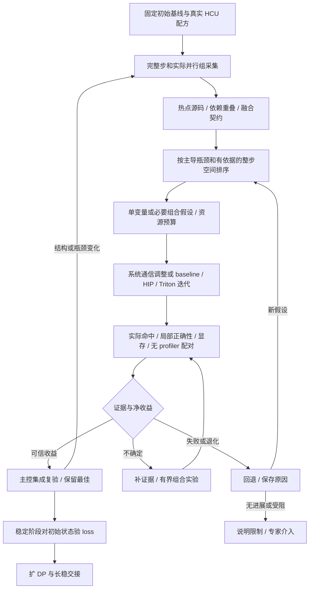

# 性能方法的来源与训练场景适配

本页说明 TrainFlow 采用哪些参考方法、如何核对、为何保留差异。执行方法见优化 Skill 的 [证据驱动闭环](../../skills/hcu-train-optimize/references/evidence-driven-loop.md) 和 [算子上限迭代](../../skills/hcu-train-optimize/references/operator-ceiling-iteration.md)。这些是工作流方法，不是新 Agent 编排系统或额外必装运行时。

## 固定参考与采用范围

2026-10-10 读取以下公开版本的文档和相关源码。这里只复核列出的性能/诊断方法，未运行它们的 AMD/NV 工作负载，未宣称整个参考仓已更新到本仓 Wiki；Wiki 原有锁定快照继续有效。

| 参考 | 固定版本与原始入口 | 采用与调整 |
|---|---|---|
| Hyperloom | AMD-AGI `880c1672a84cb718e48f640def0bd79e24294d44`：[闭环](https://github.com/AMD-AGI/Hyperloom/blob/880c1672a84cb718e48f640def0bd79e24294d44/docs/conceptual/optimization-loop.md)、[分析刷新策略](https://github.com/AMD-AGI/Hyperloom/blob/880c1672a84cb718e48f640def0bd79e24294d44/src/kernelforge/loop/analysis_refresh_policy.py)、[搜索策略](https://github.com/AMD-AGI/Hyperloom/blob/880c1672a84cb718e48f640def0bd79e24294d44/src/kernelforge/loop/search_policy.py)、[工作占比警告](https://github.com/AMD-AGI/Hyperloom/blob/880c1672a84cb718e48f640def0bd79e24294d44/src/hyperloom/orchestrator/trace_analysis/_idle_gate.py) | 初始/最佳/候选分离，主控复测、近似配方起点、热点刷新、停滞后换机制；训练按实际结构和证据变化刷新，不依赖固定收益百分比。空白先排除缺采集和依赖等待，不直接定性 CPU 瓶颈；保持有价值的独立算子分析并行。 |
| GEAK | AMD-AGI `ba509ef31d416350269266b626ec455e9d9475d1`：[端到端](https://github.com/AMD-AGI/GEAK/blob/ba509ef31d416350269266b626ec455e9d9475d1/perf_knowledge/workflows/optimize_e2e_model.md)、[集成验收](https://github.com/AMD-AGI/GEAK/blob/ba509ef31d416350269266b626ec455e9d9475d1/e2e_workflow/roles/e2e_integrator.md)、[profile 角色](https://github.com/AMD-AGI/GEAK/blob/ba509ef31d416350269266b626ec455e9d9475d1/kernel_workflow/roles/profile_engineer.md)、[wrapper](https://github.com/AMD-AGI/GEAK/blob/ba509ef31d416350269266b626ec455e9d9475d1/kernel_workflow/knowledge/wrapper_optimization.md)、[停滞反思](https://github.com/AMD-AGI/GEAK/blob/ba509ef31d416350269266b626ec455e9d9475d1/kernel_workflow/knowledge/self_monitoring.md) | 先证明命中，逐 shape 建模、资源与等待分析、API 包装成本、组合回归和原始 oracle。单卡 TP=1、固定 0.5% 门槛、推理输出对齐、统一 AMD 峰值/计数器、每轮清编译缓存不作为训练默认。训练保留 autograd、状态更新、显存和阶段 loss；不确定小收益只能待组合验证。 |
| BBuf | `6dc9c66a008daded66f214022919ff88b2186252`：[profiler Skill](https://github.com/BBuf/AI-Infra-Auto-Driven-SKILLS/blob/6dc9c66a008daded66f214022919ff88b2186252/skills/llm-torch-profiler-analysis/SKILL.md)、[归因边界](https://github.com/BBuf/AI-Infra-Auto-Driven-SKILLS/blob/6dc9c66a008daded66f214022919ff88b2186252/skills/llm-torch-profiler-analysis/references/heuristics.md)、[重叠案例](https://github.com/BBuf/AI-Infra-Auto-Driven-SKILLS/blob/6dc9c66a008daded66f214022919ff88b2186252/skills/llm-torch-profiler-analysis/references/overlap-catalog.md)、[故障分流](https://github.com/BBuf/AI-Infra-Auto-Driven-SKILLS/blob/6dc9c66a008daded66f214022919ff88b2186252/skills/sglang-prod-incident-triage/SKILL.md)、[复现/二分](https://github.com/BBuf/AI-Infra-Auto-Driven-SKILLS/blob/6dc9c66a008daded66f214022919ff88b2186252/skills/sglang-prod-incident-triage/references/replay-trace-profile.md) | 调用映射与正式时间分开；热点源码、overlap、fusion 三表；先保存失败条件再复现定位。训练扩展到 fwd/bwd/重算/更新、真实并行组与跨 rank join；区间重叠不等于因果隐藏，推理 HTTP/CUDA 调试命令不移植到 HCU 训练。 |

用户 fork `yuguo-Jack/Hyperloom@0425bde3f6e76e1588400c37d056dfd3bb75ac11` 是此前参考；本次针对 AMD 上游新版本补看方法，未更新或覆盖用户 fork。

## 与 HCU 知识连接

通过 `$hcu-knowledge-search` 定位下列 ID；路径属于独立 HCU-Knowledge，不要求把内部材料复制到本公开工程。先读正文、原件与固定来源，再核对现场版本。

| HCU 页面 ID | 对流程的约束 |
|---|---|
| `xprof-xcompute-workflow` | PMC/SQTT/replay 的作用与副作用；occupancy 理论上限、实际活跃 wave、小网格要分开；通信重放与 UTCL2 扰动需按手册处理 |
| `hipprof-2610-metrics` | MMOP 与 VALU 口径、L2 与 HBM 流量区别、wave 指标和不同架构支持；不能混用 XProf 与 hipprof 参数 |
| `infra-resource-critical-path` | 同资源工作先相加、独立资源可重叠、依赖阶段不能跨越；tile、融合和共驻资源的代价 |
| `runtime-failure-triage`、`rccl-sm-free-p2p` | 数据/通信契约和异步错误；减少占用 CU 的路径是否有利，要看实际调用和模型重叠而非变量存在 |
| `pytorch-memory-stream-graph-lifecycle`、`torchcomms-async-functional-watchdog` | 调用返回、设备完成、消费 stream 依赖和 host 检测不同；buffer/graph/异步通信生命周期 |
| `rocblas-kme-padding-contract` | 孔明e GEMM padding 案例；分析 GEMM 连同额外 copy/workspace，不能只量主矩阵指令 |

以上 ID 以当前 KB 索引为准，缺项时按标题/机制搜索。知识中的源码分析和历史实验都有各自范围，不自动成为当前硬件的性能基线。

## 在现有流程中的位置

已有 TrainFlow 的模式边界、主控独立复核、动态 Agent 分工、同形状对照、数学库 tune 输入、三项算子 Skill 和阶段 loss 继续沿用。参考工程不新增固定 Agent 人数、并行硬件争用或另一套账本。

## 维护与验证边界

更新 Wiki/Skill 时一起复核上述固定路径的新版本与本仓采用规则；重点看默认门槛、测量方法、profile 刷新、dispatch、oracle、模式/重放副作用和支持范围。只比较相关差异，不机械合并上游流程或下载整个依赖生态。相关能力变化还应检查 `analysis.py`、质量评估、TraceLens 解析、主控交接和三个阶段的异常路由。

本次方法经源码/知识查证和本地回归；没有新增 GPU 测量或故障注入。现场采集命令、跨节点因果分析、实际算子效率和生产故障恢复仍以任务验证为准。文档中的 Amdahl、Roofline 是带假设的评估方法，不能自动证明物理瓶颈、实际加速或训练收敛。
