# HCU-TrainFlow 工作流全景

本文与 `0.5.0` 的实现和 Skill 约定对应。先看[工程介绍](project-overview.md)了解任务如何推进，再按问题进入下方阶段细图；所有图均为可编辑的 Mermaid，GitHub 可直接显示。新任务或中断恢复先读[主控接手与阶段交接](agent-playbook.md)。

**读图约定：**实线表示推进、反馈或数据传递，虚线表示按需查询、指导或配套能力。方框是工作，菱形是判断，圆柱是持久资料。同一张图中的并行分支表示可拆工作，不表示每次必须启动同样数量的 Agent。

**执行边界：**主控与专家 Agent 负责判断和实施；TrainFlow CLI 负责记录、协调及证据检查；现场负责真实编译、训练、测量和既有容错。图中的训练动作是工作流要求，不能理解为都已在真实 HCU 环境验收。当前实现和现场验证范围见 [能力说明](capabilities.md)。

## 1. 全流程总览

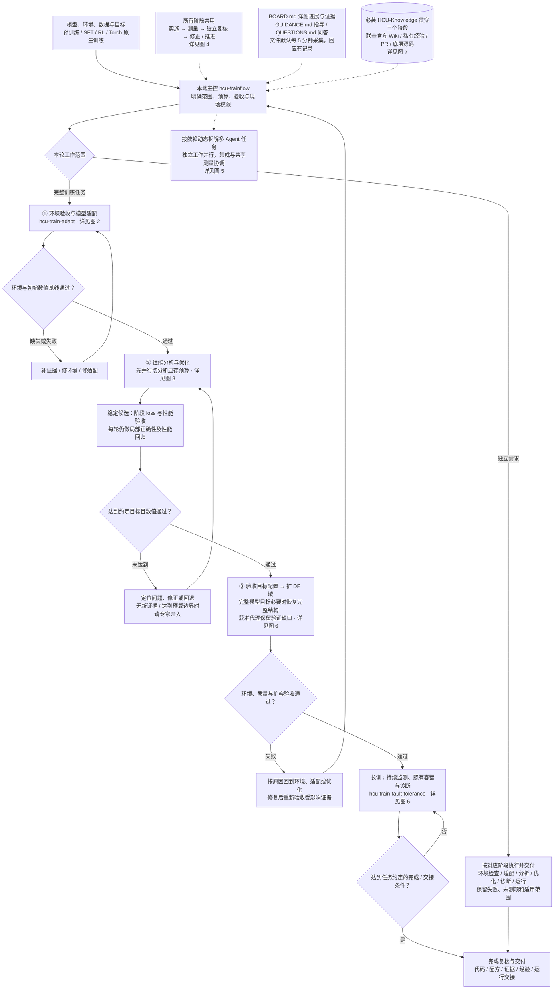

- **全流程入口：**`hcu-trainflow` 协调三个阶段 Skill，保留循环状态、证据和人的指导。
- **独立入口：**`hcu-train-adapt` 可仅检查环境；`hcu-train-optimize` 可仅分析性能；`hcu-train-fault-tolerance` 可仅诊断故障。独立任务按自己的目标交付，不强行经过后续训练阶段。
- **持续运行：**启动训练不等于完成任务；尚在约定监测范围内就继续观测和处理异常。完成或交接须有明确条件、责任人和证据。

## 2. 环境验收与模型适配

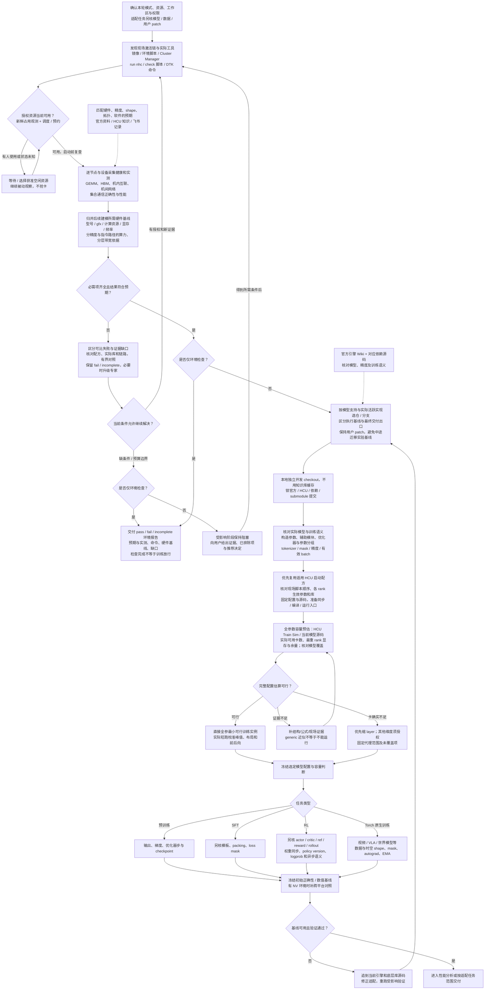

启动配方优先级是：**当前 HCU 分支同模型配方 → 同引擎相近模型的 HCU 配方 → 结合官方语义与 HCU 实现构建配方**。每一种都要核对实际生效参数，不能直接照搬 NV 的环境变量或旧 HCU 脚本。缩 layer 可用于适配/分析和筛机代理，不证明完整模型的显存、收敛和扩容能力。图中任务分支可组合，例如 Torch 原生 SFT；按实际语义核查，不是互斥类别。

工具发现和预期查证由 Agent 按现场完成；当前工程没有为所有 HCU 型号内置一套恒定验收命令和阈值。仅环境检查也可交付明确的失败或不充分报告，这不等于通过训练准入。详见 [适配 Skill](../skills/hcu-train-adapt/SKILL.md)。

## 3. 性能分析、优化与验证

### 3.1 系统调参与瓶颈定位

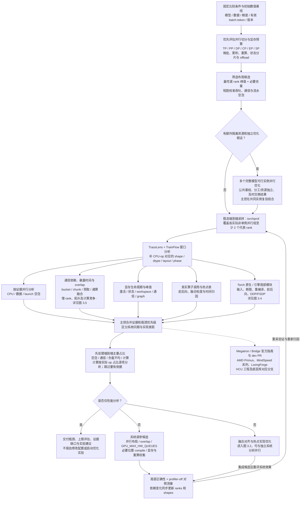

并行布局须在显存、通信、流水空泡和吞吐之间权衡，不以“占满显存”为目标。改变微批、累积或并行度时保持训练语义可比；布局变化会改变热点与 shape，需要重新分析。具体指南见 [并行切分与显存调参](../knowledge/official-megatron-wiki/parallelism.md)。

TraceLens 的逐 rank 分析可用代表样本；其完整 collective 报告要求全部 `0..N-1` rank 文件及实际通信上下文。时间对齐、RCCL 识别和统计口径要在现场核对。TrainFlow 的重叠时间归因是初步排序方法，不是自动关键路径证明。

### 3.2 融合粒度、非通信热点与优化空间

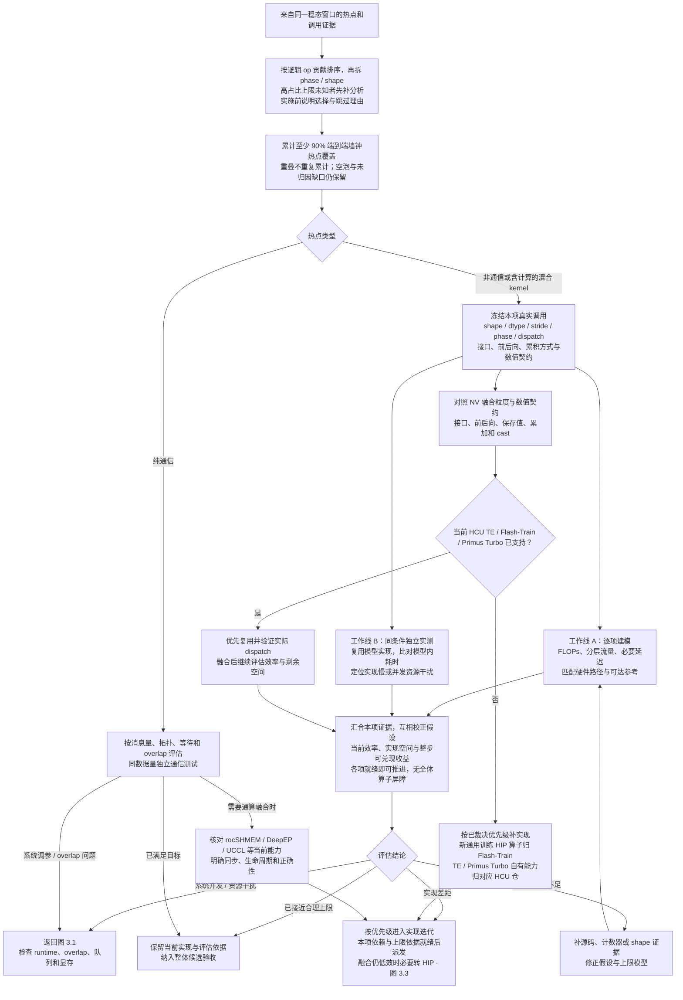

### 3.3 实现、局部回归与阶段验收

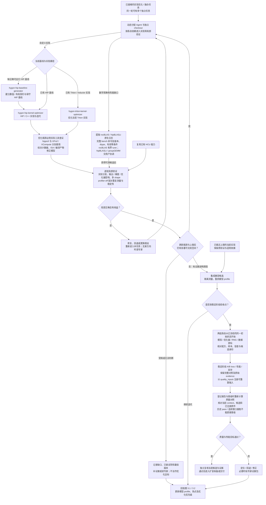

- **覆盖率分母：**每 rank 的整个训练窗口墙钟；若 GPU busy 只有 60%，剩余空泡/等待不能从分母删掉以制造 90% 覆盖。不同 rank 的时长也不相加作全局时间。
- **效率模型：**时间下界为 `max(FLOPs/匹配算力, bytes/匹配带宽, latency_floor)`；下界除以实测耗时是带假设的效率指标，不是硬件利用率。超过 1 要复核模型和测量。Attention 等复杂算子须用实际算法、IO 和重算路径建模。
- **优化节奏：**先按主要占比和真实算子排序，再裁决实施；融合对齐后仍须复评和迭代。高占比上限未知项先补分析，不因容易实现而随意选小项；停止优化给证据，缺口不冒充近峰。独立方向可并行，稳定阶段验 loss。
- **双线并行：**本项调用冻结后，同条件独立实测与上限建模可并行；不同算子按各自依赖分别进入实现。图中两条线汇合表示互相校正，不要求所有热点先完成单测。共享设备、NIC 和存储的实际测量仍须串行或确认隔离。
- **工具与归属：**XProf/XCompute 与 hipprof 按实际环境分别使用；必要时查底层库对应分支，不能用不匹配的软件栈解释现场行为。数学库确有性能缺口时提交原生日志中的完整 bench 命令，框架 shape 表只是附件；hipBLASLt/groupGEMM 当前不承诺自动 tune。
- **数值晋级：**稳定阶段按[阶段 A/B](training-state-validation.md#优化里程碑的阶段-ab-loss)建立同初态、同配方对照，登记[可重算的质量输入](contracts.md#qualitycontract-与记录)。程序核验身份和原件完整性；原件与实际运行是否一致仍由负责 Agent 和独立 reviewer 复核。局部收益或旧报告的 pass 不替代阶段质量。

详细约束见 [性能分析](profiling.md)、[优化 Skill](../skills/hcu-train-optimize/SKILL.md) 与 [三个阶段工作流](workflows.md)。

### 3.4 Torch 原生训练专项（沿用同一优化闭环）

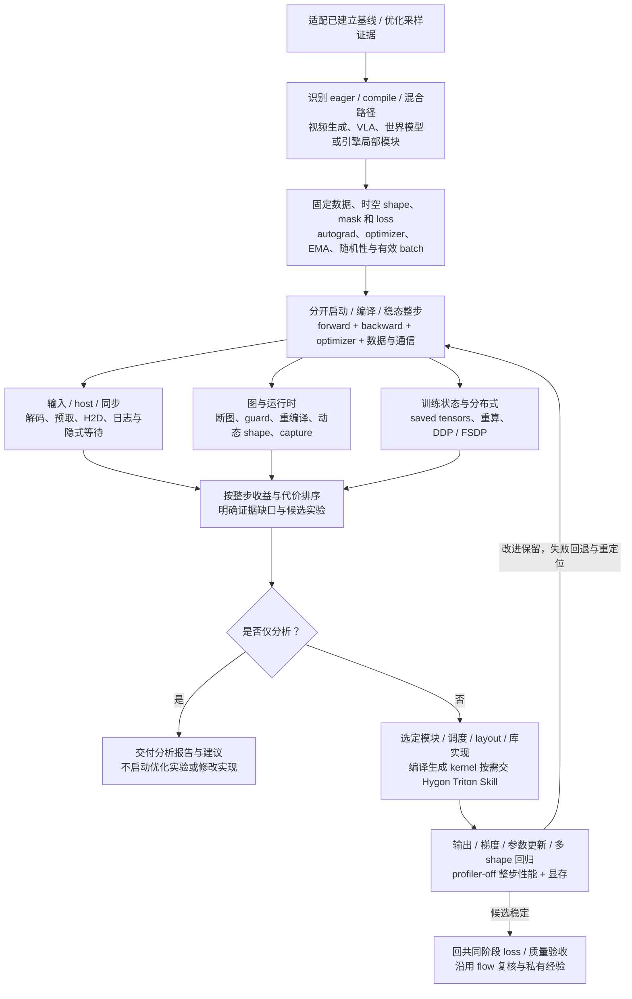

它补充 PyTorch 路径特有分析，不重复环境验收、热点上限建模、算子实现、扩 DP 和容错。AOTI/export 仅在真实使用该路径且训练/子模块契约明确时评估，不能默认替代训练编译。详见 [Torch 原生训练指引](../skills/hcu-train-optimize/references/torch-native-training.md)。

### 3.5 通信调度、overlap 与通算融合

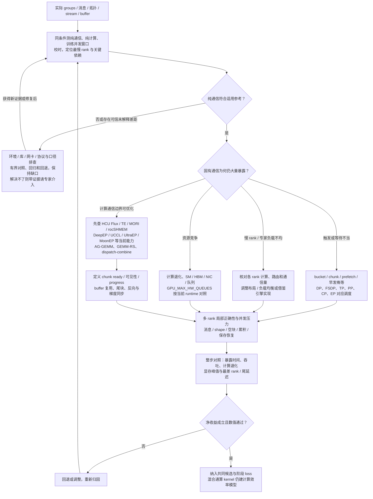

时间线相交只是观察；不等于通信已隐藏，也不保证训练更快。不同 Agent 共享同一 process-group/协议版本；耦合的同步与 buffer 生命周期由同一 owner 负责，设备/网络测量按资源协调。详见 [通信优化指引](../skills/hcu-train-optimize/references/communication-optimization.md)。

## 4. 每阶段共用：实施、独立复核、修正

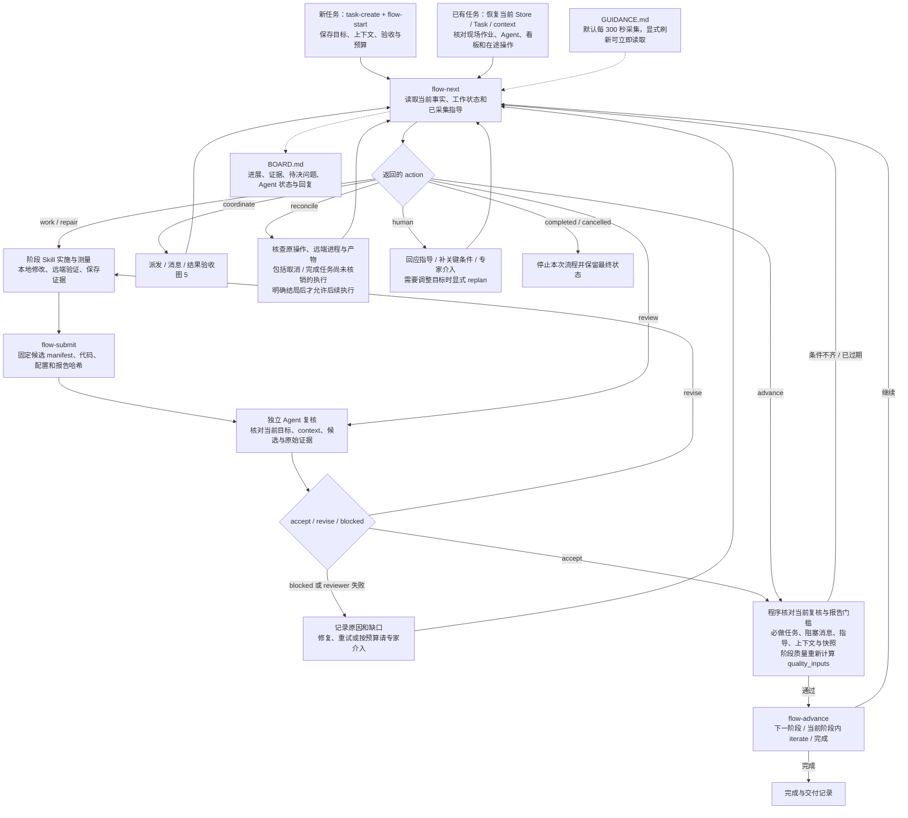

`accept` 不是 GPU 测试通过的替代物。`target: iterate` 保持当前优化任务的阶段状态，仍须具备局部正确性、真实 dispatch 和至少三组 profiler-off 配对测量；完整任务进入扩容准备仍须阶段质量与性能报告，独立优化任务按其完成契约验收。

环境、模型、数据或验证契约变化时重置比较上下文，旧报告保留但不可直接过当前门槛；改回旧配置也不能让旧验收自动复活。新的人的指导、依赖阻塞或候选修改会使未推进的旧复核失效。详见 [协作契约](collaboration.md)。

## 5. 本地多 Agent 与远端执行

### 5.1 动态任务拆解与交互

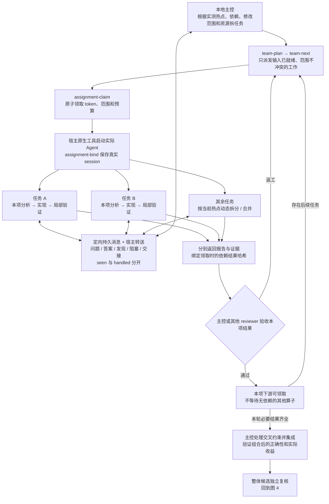

任务 A/B 是示意身份，**没有固定 Attention、GEMM、MoE Agent 名单**。只对真正的依赖建立等待关系。一个算子准备好了即可优化，其他算子继续分析或优化。

共享 GPU/NIC/测量域的实验排队；设备和干扰域确实隔离时才可并行测量。`resource_scope: operation` 允许开发任务持续并行，仅在执行时租用设备；耦合修改和最终集成由主控协调。CLI 只保存调度契约，不自行启动模型，也不是操作系统隔离沙箱。详见 [多 Agent 协同](multi-agent.md)。

### 5.2 本地代码、远程测量与执行不确定性

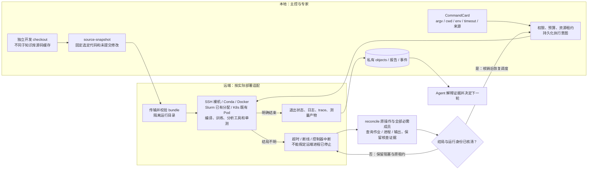

权重和数据集留在站点存储，不加入代码 bundle。未明结局先核查，不重复启动训练。跨工作区的资源互斥还须依赖站点调度器或统一协调者；本地 SQLite 不能隔离其他程序。详见 [远程执行](remote-execution.md)。

## 6. 扩容、长训、故障与离线接续

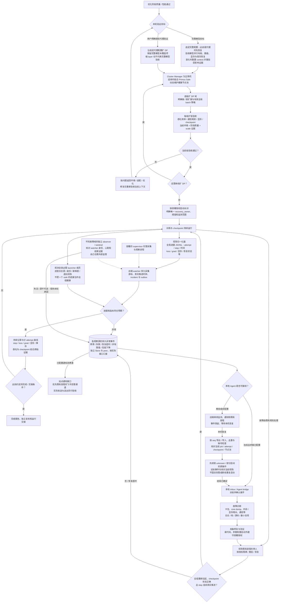

本机休眠时远端不临时启动 LLM Agent；继续工作的是 watcher、站点告警和既有容错。通知送达、bridge 返回成功、Agent 接手、故障解决是四种不同状态，不能互相代替。

恢复完整模型或扩 DP 改变比较上下文时，通过 `task-context` 更新并重新规划，取得当前环境/模型对应的基线与质量证据；缩层旧报告不能直接放行完整模型。全参新瓶颈回到适配/优化阶段处理。上图概括推进关系，不绕过 context 重置后的程序门槛。

TrainFlow 提供 watcher、事件重放、inbox、bridge 接口和报告能力；日志归一化、常驻托管、飞书实际通道、宿主接续及站点恢复规则仍要在部署时接好并实测。故障修复不建立第二套抢着重启的控制者。仅诊断任务可直接进入诊断分支，不需要启动训练或取得重启权限。详见 [长训守护](operations.md)。

## 7. 知识检索、更新与成果沉淀

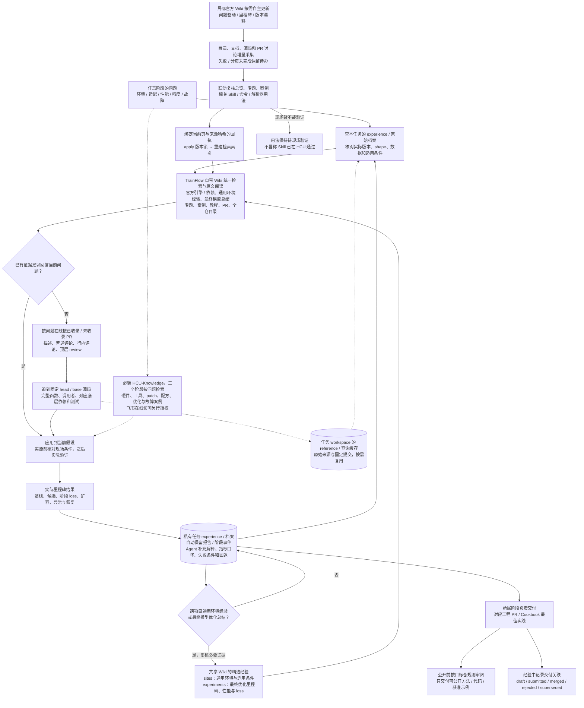

- **两个局部 Wiki Skill：**`hcu-engine-wiki-search` 负责检索、PR 和源码追查；`hcu-engine-wiki-skill-update` 负责增量采集、知识复核及关联用法检查。普通查询写私有缓存，正式收录才进入公共知识目录。
- **大知识库边界：**HCU-Knowledge 是完整安装的必需组件，可复用独立 checkout，三个阶段按问题查询；普通 TrainFlow 工作不附带更新它，更新走单独明确的维护任务。本地索引恢复不等于刷新上游内容。
- **版本边界：**局部官方 Wiki 更新不会自动替换当前训练任务的依赖或运行源码。采用新实现要形成新候选并重新验证；官方已吸收的功能应复核本地 patch 是否可以退场。
- **经验边界：**性能、loss、环境和事故的完整档案留 workspace；仅可跨项目复用的通用环境经验，以及模型最终优化里程碑总结和关键数据进入随工程提交的 Wiki；中间候选、一次性排查和完整失败过程不入库。公开 Cookbook 的方法与其私有验证记录建立关联，记录交付不等于自动发送 PR。

详见 [官方 Wiki 检索与维护](wiki.md)、[私有训练经验](experience-knowledge.md) 和 [公开边界](../CONTRIBUTING.md)。

## 8. 图与程序状态的准确对应

以下是 `full` 模式主路径的**报告门槛**，不等于 Agent 阶段内的所有判断。程序还校验报告实际执行、必需覆盖、当前上下文/候选和协作状态。

| 进入状态 | 必需报告 | 对应工作 |
| --- | --- | --- |
| `prepared` | 任务与 flow 计划 | 固定目标、预算、上下文和范围 |
| `environment_checked` | `environment` | 现场环境验收 |
| `baseline_validated` | `baseline` | 初始正确性与数值基线 |
| `profiling` | `baseline` | 以已验证基线开展采样分析 |
| `optimizing` | `analysis` | 形成瓶颈证据，开始候选迭代 |
| `scale_ready` | `stage-quality`、`performance` | 阶段质量与性能通过 |
| `training` | `environment`、`stage-quality`、`scale` | 当前候选满足训练准入 |
| `completed` | `completion` | 达到约定范围的完成条件 |

独立任务另按模式的交付契约判断，不能照搬全流程门槛。图中“先并行切分和显存预算”属于 Skill 的分析顺序，不是新增状态；图中“原生 Agent 派发”和“现场告警”也不意味着 CLI 自带模型服务或飞书机器人。

`stage-quality` 的通过报告须引用已注册的 `quality_inputs`，程序在登记和晋级时重新计算同初态、同配方、当前候选的对照。旧报告仅有 pass、旧质量契约缺少初态/配方指纹，或原件属于其他 context/候选，都不能放行新阶段。详见 [质量契约](contracts.md#qualitycontract-与记录)。

| 图中机制 | 实现 / 规则入口 |
| --- | --- |
| 任务状态、报告、证据、资源租约 | [core.py](../src/hcu_trainflow/core.py) |
| 候选、独立复核、指导与阶段推进 | [flow.py](../src/hcu_trainflow/flow.py)、[主控 Skill](../skills/hcu-trainflow/SKILL.md) |
| 任务拆解、领取、依赖、会话与消息 | [team.py](../src/hcu_trainflow/team.py) |
| 代码快照、命令卡、远端执行与核查 | [execution.py](../src/hcu_trainflow/execution.py) |
| 覆盖率、时间模型、数值检查、TraceLens | [analysis.py](../src/hcu_trainflow/analysis.py)、[quality.py](../src/hcu_trainflow/quality.py)、[tracelens.py](../src/hcu_trainflow/tracelens.py) |
| watcher、事件同步与 Agent bridge | [monitor.py](../src/hcu_trainflow/monitor.py)、[coordination.py](../src/hcu_trainflow/coordination.py) |
| 官方知识、源码 / PR、来源更新 | [wiki.py](../src/hcu_trainflow/wiki.py)、[official.py](../src/hcu_trainflow/official.py) |
| 私有经验及交付边界 | [experience.py](../src/hcu_trainflow/experience.py)、[delivery.py](../src/hcu_trainflow/delivery.py) |

修改状态、证据门槛、Skill 顺序、协作协议或监测接管规则时，应同时复核本图及 README 总览；只改图不代表实现已经具备相应能力。
