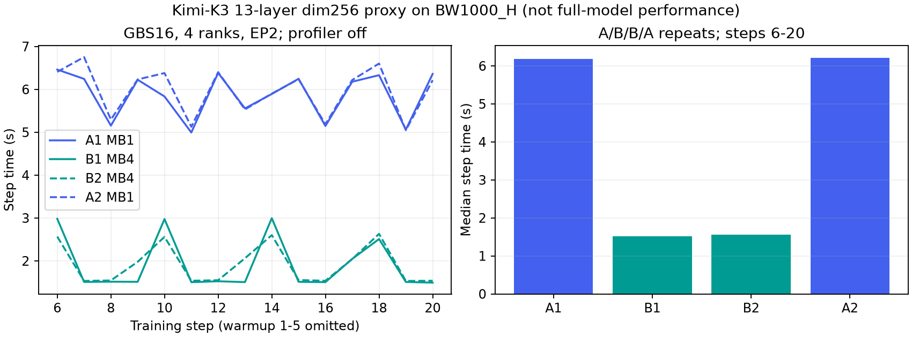

# Kimi K3：容量判断与实际优化记录

**范围：**2026-10-10 的文本预训练缩减模型实验，未证明完整 Kimi K3、生产收敛或整套容错通过。执行基线保持 donor `kimi_k3_dev@1d650f959b452f0a9b4217bb4329640df4939145` 加 HCU 适配，固定源快照 `82c9f1a605a2a6d5607f180dda3a3f0f16378def09dab3ee3c33b4bcf4d013a8`。主仓整合留待完整流程验收。

跨任务站点说明见 [BW1000_H / CFS / RoCE](../../sites/cfs-roce-bw1000/README.md)。这里保存关键配置、结果和精选原件；完整任务仍保留详细 trace、checkpoint 与过程。证据 [manifest.json](manifest.json) 记录内容哈希；压缩日志解压后应与 `source_sha256` 一致。

## 1. 为什么当前任务使用缩减模型

先查 HCU Train Simulator 并实际在本机系统 Python 安装固定 `b7d8e6f3`。CLI 显存分析运行成功，但 wrapper `kimi_k3` 与 text `kimi_linear` 都选中 `generic_gpt`；没有对 KDA/MLA 混合、AttnRes、latent experts 做完整覆盖认证，因此 **11623.42 GiB/stage 的 generic 输出不能作为 K3 准确显存预测**。

改用官方固定配置和源码可审计的容量下界：93层，首层dense，92层MoE，每层896个routed experts；每个专家的三个矩阵 `w1/w2/w3` 使用 latent hidden 3584、FFN 3072。

```text
仅 routed experts 参数量 = 92 × 896 × 3 × 3584 × 3072
                         = 2,722,740,830,208 参数
仅 BF16 专家权重           = 5,071.5 GiB
每参数16字节训练状态下界   = 40,572 GiB
```

16字节是假设BF16权重2、BF16梯度2、FP32主权重4及两个FP32 Adam状态8；当前 FP32 main_grad 更大。上述**尚未计入**attention、共享专家、embedding、router、激活、通信/临时buffer和碎片。就算乐观假设用户提供的11节点都各有8张64GiB卡且全部可用，总显存也只有5632GiB；理想完全分片后的专家训练状态下界已超过它。这个88卡数是资源上界比较，不代表已确认全空闲或已获独占预约。

因此，当前全状态驻留设备的 BF16+Adam 方案不能在给定资源范围全参训练，沿用已授权的缩层/缩维代理有明确依据；这里不判断 CPU/NVMe offload、压缩状态或冻结参数等不同训练方案的可行性。后续模型/精度/优化器/资源变化须重新评估。

证据：[计算输入与结果](evidence/capacity/assessment.json)、[官方完整配置](evidence/capacity/official-config.json)、[专家实现与层选择原文片段](evidence/capacity/model-source-excerpts.txt)、[模拟输入](evidence/capacity/full-approximation.yaml)、[模拟原始输出](evidence/capacity/simulator-stdout.log)。官方模型配置版本为 `f831ab66814297da540d832a5235f8e904f29d06`；输入中的原任务绝对路径仅作来源记录，复跑须替换成本机材料路径。通用方法见[容量预估实践](../../practices/capacity-and-parallel-experiments.md)。

## 2. 实际微批对照的配置

- 节点 `10.32.4.110`，BW1000_H gfx936，使用设备0–3；DTK26.10 / HIP7.2.26365 / Torch2.11.0 / TE2.13，镜像与通信激活链见站点页。
- 文本代理：13个逻辑decoder层（26个引擎attention/MLP条目）、hidden256、约628M参数；保留896专家、top16、KDA/MLA混合、AttnRes，seq128。该规模不是完整K3。
- TP=PP=CP=ETP=1，dense-DP4、EP2、expert-DP2；GBS固定16。A为MB1/累积4，B为MB4/累积1；grouped GEMM和已验证原生gradient accumulation fusion都开启。
- 四次全新20步，顺序 A/B/B/A；固定源快照与数据、profiler关闭、无eval/checkpoint，取步骤6–20。日志首步含编译开销，未纳入稳态。每次运行前重新准入，不与其他用户抢卡。
- seed、源版本/config哈希和实际启动命令保存在各 `training.log.gz` 解压后首个启动审计 JSON 的 `settings.seed`、`source_revision`、`config_sha256`、`command` 字段；同目录 `attempt.json` 保存运行上下文、进程身份和预期步数。不同运行仍有轻微数值差异。有效GBS相同不自动证明微批变化对路由/量化/归约或loss完全等价，后续稳定阶段再统一验收。

## 3. 微批优化结果

| 实验 | MB / 累积 | 稳态中位数 ms | 稳态均值 ms | 最小–最大 ms | 峰值 allocated MiB | 峰值 reserved MiB |
| --- | --- | ---: | ---: | --- | ---: | ---: |
| A1 | 1 / 4 | 6178.2 | 5871.4 | 4994.3–6461.6 | 7041.58 | 7188 |
| B1 | 4 / 1 | 1512.3 | 1906.7 | 1492.8–2996.4 | 7645.65 | 7764 |
| B2 | 4 / 1 | 1553.4 | 1917.5 | 1532.3–2630.9 | 7646.49 | 7764 |
| A2 | 1 / 4 | 6218.3 | 5969.0 | 5048.0–6753.2 | 7041.58 | 7188 |

两组“每次运行稳态中位数”的均值分别为6198.25ms和1532.85ms，约4.04倍吞吐比/75.27%步时降低。B有明显长尾；按两次均值的平均比较约为3.10倍，不能只报最好一次。allocated增加约605MiB，约6.88→7.47GiB。这里的峰值是日志所报告值，不能代替全rank设备外部驻留/恢复峰值测量。



解释假设：增大microbatch减少每次更新的前后向重复调用与小kernel派发，并改变专家GEMM形状；需要新profile确认分项贡献，不能把总收益全算成GEMM融合。保留MB1基线和新候选，以新profile指导下一轮。**本节是性能候选，不是阶段loss最终通过。** 四次第20步loss为12.03250、12.03263、12.03264、12.03264，仅作有限窗口观测。

证据：[完整逐步指标](evidence/microbatch-abba.json)；[A1日志](evidence/A1/training.log.gz)、[B1日志](evidence/B1/training.log.gz)、[B2日志](evidence/B2/training.log.gz)、[A2日志](evidence/A2/training.log.gz)；各同目录含原始启动身份与退出回执。

## 4. FP32主权重回拷：局部候选

旧 TE `multi_tensor_scale` 转换在特殊 BF16 边界不能保持原 `copy_` 的逐字节结果，已拒绝。替代候选是现有 Torch `torch._foreach_copy_`，先做独立验证，不改模型后假定精度正确。

在上述镜像同一节点独立测试 contiguous、互不重叠的 FP32→BF16 张量对：标量/空张量、边界长度、offset与guard、全部65536种BF16高16位乘6种低位舍入模式（含NaN/subnormal/正负零），以及64/1024/10752对真实专家投影shape。六组对照均无目标字节差异；专门边界测试同时验证源未变。

| 张量对数 | 原逐张量回拷 ms | foreach回拷 ms | 测量范围 |
| ---: | --- | --- | --- |
| 64 | 0.315–0.317 | 0.0505–0.0508 | 两次区块中位数范围 |
| 1024 | 4.667–4.669 | 0.367–0.370 | 同上 |
| 10752 | 43.97–44.24 | 3.654–3.657 | 同上，当前EP2每rank专家矩阵数 |

每区块3次warmup、10次测量，A/B/B/A；数字是CPU提交到设备完成的同步墙钟，不是纯kernel时间。1024对profile显示原路径1024次 `vectorized_elementwise_kernel`，foreach路径16次 `multi_tensor_apply_kernel`，有实际分发证据。

**限制：**这里只验证所列布局/位级转换与独立性能，未验证模型集成、非连续/alias、graph capture或阶段loss，也不能将约40ms局部收益直接加到整步。集成前检查真实master→model映射和调用位置，保留fallback与显式开关，再用相同基线做端到端验证。

证据：[结果与全部采样](evidence/foreach-copy/result.json)、[原始trace](evidence/foreach-copy/trace.json.gz)、[实际测试脚本](evidence/foreach-copy/qualify_foreach.py)。

## 5. 下一次继续时

先检索本页与站点页，复核硬件/镜像/源/数据/并行配置是否匹配。复用未受影响的原生gradient fusion资格；微批已完成ABBA，不重复同一比较来代替新分析。继续MB4完整rank profile、剩余端到端归因、真实shape效率/上限、foreach候选集成和稳定阶段loss；恢复验证单列。完整K3、规模效率、真实自动容错仍未由本页证明。
