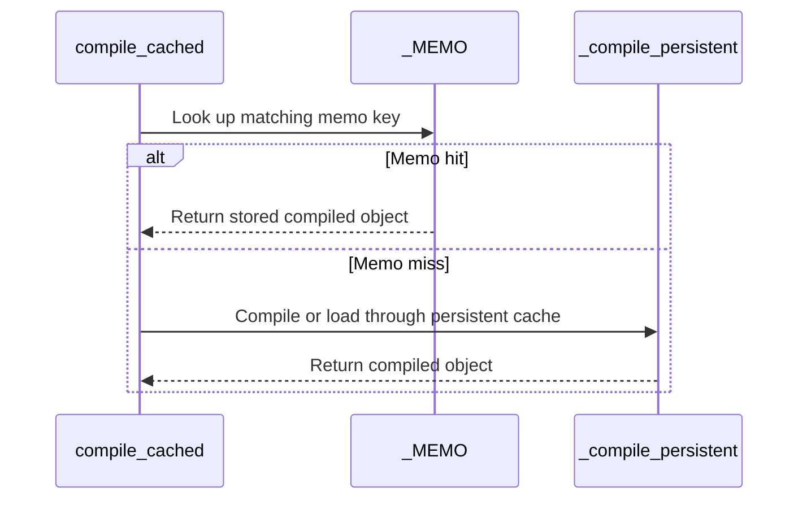

# frost(compiled_cache): an in-process memo in front of the compiled-plan cache

[Upstream PR](https://github.com/NVIDIA/cudnn-frontend/pull/1456) · state: closed · merged: True

## Original PR description

## Before submitting

- [x] I agree to license this contribution under the terms of [LICENSE.txt](https://github.com/NVIDIA/cudnn-frontend/blob/develop/LICENSE.txt).
- [x] I ran `pre-commit run` and committed any formatting changes.
- [x] I reviewed the Hard Rules in the `AGENTS.md` for each directory this PR touches (see [root AGENTS.md, Reviewing a PR](https://github.com/NVIDIA/cudnn-frontend/blob/develop/AGENTS.md#reviewing-a-pr-human-or-agent)) and my changes comply, or I explain the exception below.
- [x] I added GitHub labels: one `cat-*`, one or more `area:*` / `op:*`, and one `orig-*` (see [label list](https://github.com/NVIDIA/cudnn-frontend/labels)).

## Affected area

FE OSS kernels or CuTeDSL -- the FROST compiled-plan cache (`python/cudnn/frost/compiled_cache.py`, Python only).

## Summary

`compile_cached` keeps an **in-process memo** in front of the compiled-plan cache: the object it already produced for the same `(target device, live device, cache_key, symbol, options)` in the same process is handed out again -- no trace, no compile, no file touched -- whatever the on-disk cache's state.

- Process-local, guarded by the module lock; threads racing on an empty slot each compile once and all leave with the first object stored (`dict.setdefault`).
- Deliberately unbounded: one entry per distinct kernel the process ever compiled, the very object the execution plan that asked for it keeps alive anyway; `clear_memo()` forgets it.
- A `cache_key` of `None` is never memoised; a failed compile is not memoised.
- The key names two CUDA ordinals (`_memo_device()`): the device a build targets (a `build_device()` scope -- the handle's device -- else the live device; a compiled object bakes device-derived constants such as the SM count, exactly as the on-disk manifest names the device) and the live device the compile is issued under (the DSL ties a compiled object's executor to the device context it was created in, and the gemm / conv engines build under the handle's device scope but launch under whatever context is current at execute). For every build without a handle the two agree, so the key is just the device; a build scoped to another device than the live one is its own object, as a per-build compile always made it.
- `CUDNN_FRONTEND_COMPILED_CACHE_INPROCESS_MEMO=0` turns the memo off; `stats()["memo_hits"]` counts the hits; `memo_enabled()` reports the switch.
- The on-disk cache is unchanged (same `_SCHEMA`, same entries, same counters): the memo sits in front of it. Kernels compiled without `--enable-tvm-ffi` -- never persisted -- are memoised too; the memo needs no exportable object.
- The four SM80 tests that assert an in-process RELOAD of a persisted artifact (a second plan, `cute.compile` forbidden, `stats()["hits"]` grows) switch the memo off for their own process; `python/cudnn/AGENTS.md` ("Prove artifact reuse across plans") records why, and `docs/utilities/python_graph_and_execution_backends.md` documents the memo, its key and the switch beside the other cache variables.

## Why

`cute.compile` has no memo of its own, and neither had `compile_cached`: a graph that builds several plans over one kernel, or a test suite that builds one block instance per case, paid a full JIT per plan. With the on-disk cache off or cold, that was most of a suite's wall time: on a Rubin cc 10.7 development part (204 SMs) with the cache off, JIT was 51-71 % of the two gated-attention-block backward suites' wall time (486 of 682 s on the bf16 suite, 214 of 421 s on its fp8 twin) -- the same 22-31 kernels compiled again for every block instance.

Measured on the same part, compiled-plan cache off, `gated_attention_block/cutedsl/test_block_backward.py` (109 cases), the memo off / on / off back to back on one device:

| | memo off | memo on | memo off (again) |
|---|---:|---:|---:|
| wall time | 855 s | **261 s** | 770 s |
| `cute.compile` calls | 730 | **100** | 730 |
| seconds inside `cute.compile` | 665 | **119** | 616 |
| memo hits | 0 | 630 | 0 |
| outcome | 108 passed, 1 skipped | 108 passed, 1 skipped | 108 passed, 1 skipped |

x3.3 / x2.9 on the suite's wall time (+228 % / +195 % against the two memo-off runs); 630 of the 701 `compile_cached` calls served by the memo; identical outcomes and the identical skipped cell in all three runs. Re-run once the key carried the live device as well: 108 passed, 1 skipped in 252 s, 100 `cute.compile` calls, 630 memo hits -- the same counters. Development-node wall time, not a performance number.

## How to use

Nothing to do: the memo is on by default for every `compile_cached` call that passes a `cache_key`.

- `CUDNN_FRONTEND_COMPILED_CACHE_INPROCESS_MEMO=0` (also `false` / `no` / `off`) turns it off for the process -- for a test of the reload path itself, or an A/B of the memo.
- `cudnn.frost.compiled_cache.clear_memo()` releases every memoised object; what callers already hold stays valid, and the next call for a forgotten key reaches the files or the compiler again.
- `cudnn.frost.compiled_cache.stats()["memo_hits"]` counts the calls served from the memo (`hits` / `misses` keep counting the files only).
- A test that asserts an in-process reload from the files (`cute.compile` forbidden, `stats()["hits"]` grows) sets the switch to `0` for its process first (`monkeypatch.setenv`), as the four SM80 tests here do: with the memo on, the second plan gets the first plan's object without touching the files, and a key compiled by an earlier test in the same process turns even the first build into a memo hit, leaving nothing on disk to reload.

## Related issues

None.

## API and compatibility impact

- `compile_cached`'s signature is unchanged. Its behaviour changes in one way: a second call with the same `(cache_key, symbol, options)` on the same device pair in the same process returns the object the first call returned instead of a fresh compile or a fresh reload. The compiled object is a stateless callable that a plan already shares across every execute, so callers see the same results.
- Additions: `compiled_cache.memo_enabled()`, `compiled_cache.clear_memo()`, the `memo_hits` key of `stats()`, the environment variable `CUDNN_FRONTEND_COMPILED_CACHE_INPROCESS_MEMO`. No change to the on-disk format, `_SCHEMA`, the manifest or the pruning.
- Memory: the memo holds one compiled object (cubin + host stub, hundreds of KB) per distinct key the process compiled, for the life of the process or until `clear_memo()`. While the plans that asked for them are alive the footprint is zero extra; a caller that mints ever-new keys (a sweep over shapes) pays a compile per key anyway and has `clear_memo()` as the release valve.
- The memo trusts `cache_key` exactly as the on-disk cache does: the key must cover everything that changes the kernel. A key that under-specifies its kernel was already a wrong reload with the on-disk cache on; with this change it is also a wrong memo hit with the on-disk cache off.
- No change to supported GPU / cuDNN / CUDA / Python versions.

## Testing

Host tier (an A100 host; these modules do no GPU work), from `test/python`:

```
pytest -q -o addopts= core/frost/test_compiled_cache.py linear_attention/frost/test_frost_compiled_cache.py
# 24 passed in 6.9 s  (core: 21 = 11 existing + 10 new memo tests; linear_attention: 3)
pytest -q -o addopts= -m "L0 or L1" sdpa/frost/test_sdpa_bwd_thd_sm80.py sdpa/frost/test_sdpa_sm80_prepared_compile_cache.py \
    sdpa/frost/test_sdpa_sm80_thd_forward_prepared.py sdpa/frost/test_sdpa_sm80_thd_wrapper_prepared.py
# 250 passed, 0 failed in 360 s  (run before the key gained the live device, a path these modules never reach: with the switch off, _memo_device() is not called)
```

The new memo tests (a fake `cute.compile`, no DSL compile): the same object without a second compile with the on-disk cache off; the memo in front of an enabled on-disk cache (one miss, one load attempt, then a memo hit); the key covers `cache_key` / `symbol` / `options`, the device a build targets and the live device the compile is issued under (`build_device(1)` under live device 0, then under live device 1: two objects); a `None` key is never memoised; a failed compile is not memoised; the switch and its accepted spellings; `clear_memo()` keeps what callers hold valid; twelve threads racing on three keys leave with one object per key. RED check: the unmodified `test_replan_reloads_prepared_artifact` with the memo on fails `assert hits > counts["hits"]` (`0 > 0`) -- the trap the switch removes.

Rubin cc 10.7 development part (204 SMs), compiled-plan cache off (`CUDNN_FRONTEND_DISABLE_COMPILED_CACHE=1`), `-m L0`:

```
pytest -q -o addopts= -m L0 core/frost/test_compiled_cache.py gemm/frost/test_compiled_cache_gpu.py sdpa/frost/test_sdpa_compiled_cache_gpu.py
# 23 passed in 272 s  (the child-process reloads included; every child imported this branch)
pytest -q -o addopts= -m L0 gated_attention_block/cutedsl/test_block_backward.py
# memo on:  108 passed, 1 skipped in 252-261 s; 100 cute.compile calls, 630 memo hits
CUDNN_FRONTEND_COMPILED_CACHE_INPROCESS_MEMO=0 pytest -q -o addopts= -m L0 gated_attention_block/cutedsl/test_block_backward.py
# memo off: 108 passed, 1 skipped in 770-855 s; 730 cute.compile calls
```

Two devices visible to one process, a plain fill kernel through `compile_cached` directly (cache off): a build scoped to device 1 issued under device 0 and the same build issued under device 1 are two compiles and two objects with this key (one compile and a memo hit with a key of the target device alone), and every launch -- each object under its own device -- wrote the right values. The pair in the key restores the DSL's one-object-per-context contract; it does not fix a reproduced failure.

`pre-commit run --files` on the eight changed files: black, black-jupyter and the SPDX license header passed (clang-format: no files).

## Review focus

1. The key (`_memo_device()` + `cache_key` + `symbol` + `options`): is anything else baked into a compiled object that two callers could legitimately differ on within one process? The on-disk manifest's answer is "the device"; the memo adds the live context. The `fn` object itself is deliberately not part of the key -- a `cache_key` already names the kernel and its source, as it does for the files.
2. Memoising kernels that are never persisted (no `--enable-tvm-ffi`, pointer-converting objects): the memo returns whatever `compile_cached` would have handed out, the object a caller would otherwise have re-traced -- flag any caller that relies on a fresh trace per call.
3. The unbounded memo with `clear_memo()` as its only release valve (reasoning in the `_MEMO` comment); whether an opt-in cap is wanted for shape sweeps.
4. Lock scope: `_LOCK` guards the dict read and the `setdefault` only, never the compile -- concurrent first compiles of one key each run once and converge on the first stored object (pinned by the twelve-thread test).
5. The four SM80 reload tests' switch and the `python/cudnn/AGENTS.md` guidance: the test-ordering trap (a key compiled by an earlier test in the same process) is the part that would otherwise bite the next author of a reload test.
6. Docs wording in `docs/utilities/python_graph_and_execution_backends.md`.

🤖 Generated with [Claude Code](https://claude.com/claude-code)


<!-- This is an auto-generated comment: release notes by coderabbit.ai -->

## Summary by CodeRabbit

* **New Features**
  * Compiled objects can now be reused within a process for matching devices, cache keys, symbols, and compile options, including when disk caching is disabled.
  * The in-process memo can be disabled with an environment variable or cleared explicitly. Cache statistics now report memo hits.
  * Calls without a cache key and failed compilations are not memoized.
* **Documentation**
  * Updated guidance to distinguish in-process memo hits from persistent-cache hits and explain how to test artifact reloads.

<!-- end of auto-generated comment: release notes by coderabbit.ai -->

## Review and discussion

### reviews

- vedaanta · APPROVED · 2026-10-07T19:35:39Z · [source](https://github.com/NVIDIA/cudnn-frontend/pull/1456#pullrequestreview-5447372643)

Codex bot review · model: `gpt-6-astra`

Reviewed `bfb596d21f2afea0b8a9b816097f0c1380e24c6b`. No actionable findings. The memo preserves the persistent-cache path, distinguishes target/live device pairs, and leaves artifacts already held by plans usable after `clear_memo()`.

Validation: 21 core cache tests, 26 selected SM80 artifact-reload tests on A100, and four linear-attention/cache and cross-process GEMM tests passed. An independent real-kernel probe on two SM100 GPUs exercised all four target/live device pairs, same-key object identity, distinct objects across pairs, changed-input CUDA graph replay, and retained/replacement artifacts after clearing. Separate BF16 GEMM graphs with different input allocations reused the same artifact while `cute.compile` was forbidden; numerical checks and replay passed before and after clearing/rebuilding.

A focused warm-artifact lookup comparison with the persistent cache enabled, memo off/on/on/off, measured medians of 7.72 ms / 12.32 µs / 12.48 µs / 7.74 ms. This measures artifact lookup only, not end-to-end application speedup; the reported Rubin suite speedup was not independently reproduced. The documented unbounded retention and explicit release switch are intentional API behavior. Style checks passed at review time.

<!-- codex-fe-review:github-only:vedaanta:1456:bfb596d21f2afea0b8a9b816097f0c1380e24c6b:complete -->

### issue_comments

- coderabbitai[bot] · comment · 2026-10-07T18:54:02Z · [source](https://github.com/NVIDIA/cudnn-frontend/pull/1456#issuecomment-6044664984)

<!-- This is an auto-generated comment: summarize by coderabbit.ai -->
<!-- review_stack_entry_start -->

<a href="https://app.coderabbit.ai/change-stack/NVIDIA/cudnn-frontend/pull/1456?scope=ghh_OusAJGA4HG8ljoOV0wJvVx8NmnZIjc2DdjmxOu0xZWA&amp;cs_source=review_comment"></a>

<!-- review_stack_entry_end -->
<!-- recent_review_start -->

No actionable comments were generated in the recent review. 🎉

<details>
<summary>ℹ️ Recent review info</summary>

<details>
<summary>⚙️ Run configuration</summary>

- **Configuration used**: Repository: NVIDIA/cudnn-frontend/.coderabbit.yaml
- **Review profile**: CHILL
- **Plan**: Enterprise
- **Run ID**: `a7451731-ad4a-4c42-817b-69743ded18dd`

</details>

<details>
<summary>📥 Commits</summary>

Reviewing files that changed from the base of the PR and between 9104670ff0ee5528919da00d1c90469c645974fd and bfb596d21f2afea0b8a9b816097f0c1380e24c6b.

</details>

<details>
<summary>📒 Files selected for processing (8)</summary>

* `docs/utilities/python_graph_and_execution_backends.md`
* `python/cudnn/AGENTS.md`
* `python/cudnn/frost/compiled_cache.py`
* `test/python/core/frost/test_compiled_cache.py`
* `test/python/sdpa/frost/test_sdpa_bwd_thd_sm80.py`
* `test/python/sdpa/frost/test_sdpa_sm80_prepared_compile_cache.py`
* `test/python/sdpa/frost/test_sdpa_sm80_thd_forward_prepared.py`
* `test/python/sdpa/frost/test_sdpa_sm80_thd_wrapper_prepared.py`

</details>

**Included review availability:** This review used your included allowance. Your plan provides up to 12 included reviews per hour; 11 remain after this review.

</details>

---


<!-- recent_review_end -->
<!-- walkthrough_start -->

<details>
<summary>📝 Walkthrough</summary>

## Walkthrough

The compiled cache now memoizes compiled objects in-process using device context, cache key, symbol, and compile options. The change adds controls and statistics for the memo, tests its behavior, and disables it in tests that verify persistent-cache reloads.

### Changes

**In-process compiled-object memo**

|Layer / File(s)|Summary|
|:---|:---|
|**Memo lookup and compilation** <br> `python/cudnn/frost/compiled_cache.py`, `docs/utilities/python_graph_and_execution_backends.md`|The cache memoizes keyed compiled objects using device context, cache key, symbol, and options. It adds a disable setting, `clear_memo()`, and a `memo_hits` statistic. Memo hits return the stored object before persistent-cache work.|
|**Memo and reload tests** <br> `test/python/core/frost/test_compiled_cache.py`, `test/python/sdpa/frost/*`, `python/cudnn/AGENTS.md`|Tests cover memo reuse, key separation, opt-out, clearing, failed compiles, and concurrent calls. Reload tests disable the memo so they can exercise persistent-cache behavior. Test guidance describes the distinction between memo hits and disk-cache hits.|

<!-- change_assessment_start -->
**Priority:** ➖ Normal

**Estimated code review effort:** 3 (Moderate) | ~20 minutes

<!-- change_assessment_commit:"bfb596d21f2afea0b8a9b816097f0c1380e24c6b" -->
**Change:** Feature
<!-- change_assessment_end -->

### Sequence Diagram(s)



**Suggested reviewers:** `yangxu1990uiuc`

</details>

<!-- walkthrough_end -->
<!-- final_review_risk_start -->
**Merge Risk:** _⚪ Minimal_ · up to `bfb59`
<!-- final_review_risk_coverage:{"sourceCommitId":"bfb596d21f2afea0b8a9b816097f0c1380e24c6b","coveredCommitId":"bfb596d21f2afea0b8a9b816097f0c1380e24c6b","kind":"reviewed"} -->

The change adds an opt-out in-process memo for compiled kernels, with tests and documentation. No concrete merge-blocking issue was found.
<!-- final_review_risk_end -->
<!-- pre_merge_checks_walkthrough_start -->

<details>
<summary>🚥 Pre-merge checks | ✅ 4 | ❌ 1</summary>

### ❌ Failed checks (1 warning)

|     Check name     | Status     | Explanation                                                                                                                                                                                               | Resolution                                                                         |
| :----------------: | :--------- | :-------------------------------------------------------------------------------------------------------------------------------------------------------------------------------------------------------- | :--------------------------------------------------------------------------------- |
| Docstring Coverage | ⚠️ Warning | Docstring coverage is 58.06% which is insufficient. The required threshold is 80.00%. Docstring coverage is scoped to functions touched by this diff. Analyzed 31 functions across 6 files. (2 skipped: … | Write docstrings for the functions missing them to satisfy the coverage threshold. |

<details>
<summary>✅ Passed checks (4 passed)</summary>

|         Check name         | Status   | Explanation                                                                                                                                                                                               |
| :------------------------: | :------- | :-------------------------------------------------------------------------------------------------------------------------------------------------------------------------------------------------------- |
|         Title check        | ✅ Passed | The title clearly and concisely identifies the main change: adding an in-process memo in front of the FROST compiled-plan cache.                                                                          |
|      Description check     | ✅ Passed | The description follows the required template and covers the affected area, summary, rationale, related issues, API and compatibility impact, and exact testing results. It also documents configuration… |
|     Linked Issues check    | ✅ Passed | Check skipped because no linked issues were found for this pull request.                                                                                                                                  |
| Out of Scope Changes check | ✅ Passed | Check skipped because no linked issues were found for this pull request.                                                                                                                                  |

</details>

<details>
<summary>Full details: Docstring Coverage</summary>

**Explanation**

Docstring coverage is 58.06% which is insufficient. The required threshold is 80.00%. Docstring coverage is scoped to functions touched by this diff. Analyzed 31 functions across 6 files. (2 skipped: 2 unsupported.)

</details>

</details>

<!-- pre_merge_checks_walkthrough_end -->

- [ ] <!-- {"checkboxId":"585bb3f6-faf5-4dbf-96d2-74e382adf19a"} --> Fix all pre-merge checks with AI
<!-- finishing_touch_checkbox_start -->

<details>
<summary>✨ Finishing Touches 💡 1</summary>

<!-- finishing_touch_suggestion:fix_ci -->
<details open>
<summary>🛠️ Fix failing CI checks 💡</summary>

- [ ] <!-- {"checkboxId": "9f0d24fb-b419-4f01-baf0-8b26b6424f34", "radioGroupId": "fix-ci-output-choice-group-unknown_comment_id"} --> Commit to this branch
- [ ] <!-- {"checkboxId": "6d21cfe8-ec3f-40e2-9222-b8318b64d3b0", "radioGroupId": "fix-ci-output-choice-group-unknown_comment_id"} --> Create a new PR

</details>
<details open>
<summary>🧪 Generate unit tests (beta)</summary>

- [ ] <!-- {"checkboxId": "f47ac10b-58cc-4372-a567-0e02b2c3d479", "radioGroupId": "utg-output-choice-group-unknown_comment_id"} --> Create a new PR

</details>

</details>

<!-- finishing_touch_checkbox_end -->

<!-- autopilot:start -->
- [ ] <!-- {"checkboxId":"2708ad07-9f24-4260-9c11-7dc76a49f2e3"} --> <strong title="Keep fixing CodeRabbit findings and required CI, and resolving merge conflicts">Autopilot</strong> · Keep fixing CodeRabbit findings and required CI, and resolving merge conflicts
<!-- autopilot:end -->
<!-- tips_start -->

---


<sub>Comment `@coderabbitai help` to get the list of available commands.</sub>

<!-- tips_end -->

### inline_comments

## Changed files and fixed code

- `docs/utilities/python_graph_and_execution_backends.md` · modified · additions 18 / deletions 2
  - [head](https://github.com/RomanAnders90/cudnn-frontend/blob/bfb596d21f2afea0b8a9b816097f0c1380e24c6b/docs/utilities/python_graph_and_execution_backends.md)
  - [base](https://github.com/NVIDIA/cudnn-frontend/blob/9104670ff0ee5528919da00d1c90469c645974fd/docs/utilities/python_graph_and_execution_backends.md)
- `python/cudnn/AGENTS.md` · modified · additions 7 / deletions 1
  - [head](https://github.com/RomanAnders90/cudnn-frontend/blob/bfb596d21f2afea0b8a9b816097f0c1380e24c6b/python/cudnn/AGENTS.md)
  - [base](https://github.com/NVIDIA/cudnn-frontend/blob/9104670ff0ee5528919da00d1c90469c645974fd/python/cudnn/AGENTS.md)
- `python/cudnn/frost/compiled_cache.py` · modified · additions 103 / deletions 5
  - [head](https://github.com/RomanAnders90/cudnn-frontend/blob/bfb596d21f2afea0b8a9b816097f0c1380e24c6b/python/cudnn/frost/compiled_cache.py)
  - [base](https://github.com/NVIDIA/cudnn-frontend/blob/9104670ff0ee5528919da00d1c90469c645974fd/python/cudnn/frost/compiled_cache.py)
- `test/python/core/frost/test_compiled_cache.py` · modified · additions 229 / deletions 2
  - [head](https://github.com/RomanAnders90/cudnn-frontend/blob/bfb596d21f2afea0b8a9b816097f0c1380e24c6b/test/python/core/frost/test_compiled_cache.py)
  - [base](https://github.com/NVIDIA/cudnn-frontend/blob/9104670ff0ee5528919da00d1c90469c645974fd/test/python/core/frost/test_compiled_cache.py)
- `test/python/sdpa/frost/test_sdpa_bwd_thd_sm80.py` · modified · additions 1 / deletions 0
  - [head](https://github.com/RomanAnders90/cudnn-frontend/blob/bfb596d21f2afea0b8a9b816097f0c1380e24c6b/test/python/sdpa/frost/test_sdpa_bwd_thd_sm80.py)
  - [base](https://github.com/NVIDIA/cudnn-frontend/blob/9104670ff0ee5528919da00d1c90469c645974fd/test/python/sdpa/frost/test_sdpa_bwd_thd_sm80.py)
- `test/python/sdpa/frost/test_sdpa_sm80_prepared_compile_cache.py` · modified · additions 1 / deletions 0
  - [head](https://github.com/RomanAnders90/cudnn-frontend/blob/bfb596d21f2afea0b8a9b816097f0c1380e24c6b/test/python/sdpa/frost/test_sdpa_sm80_prepared_compile_cache.py)
  - [base](https://github.com/NVIDIA/cudnn-frontend/blob/9104670ff0ee5528919da00d1c90469c645974fd/test/python/sdpa/frost/test_sdpa_sm80_prepared_compile_cache.py)
- `test/python/sdpa/frost/test_sdpa_sm80_thd_forward_prepared.py` · modified · additions 1 / deletions 0
  - [head](https://github.com/RomanAnders90/cudnn-frontend/blob/bfb596d21f2afea0b8a9b816097f0c1380e24c6b/test/python/sdpa/frost/test_sdpa_sm80_thd_forward_prepared.py)
  - [base](https://github.com/NVIDIA/cudnn-frontend/blob/9104670ff0ee5528919da00d1c90469c645974fd/test/python/sdpa/frost/test_sdpa_sm80_thd_forward_prepared.py)
- `test/python/sdpa/frost/test_sdpa_sm80_thd_wrapper_prepared.py` · modified · additions 1 / deletions 0
  - [head](https://github.com/RomanAnders90/cudnn-frontend/blob/bfb596d21f2afea0b8a9b816097f0c1380e24c6b/test/python/sdpa/frost/test_sdpa_sm80_thd_wrapper_prepared.py)
  - [base](https://github.com/NVIDIA/cudnn-frontend/blob/9104670ff0ee5528919da00d1c90469c645974fd/test/python/sdpa/frost/test_sdpa_sm80_thd_wrapper_prepared.py)

## Evidence and interpretation boundary

[Original JSON, discussions and patches](../../evidence/prs/NVIDIA--cudnn-frontend/1456-3b98175f54f3dcee0a59207ff5cc639584febc355f92622bc8a9451003ef8468.json) · SHA-256 `3b98175f54f3dcee0a59207ff5cc639584febc355f92622bc8a9451003ef8468`.

Diff complete: True. Missing/binary/truncated patches require pinned source inspection. This is a source page, not an independently verified optimization case. Open, merged and released are different states; recheck the deployed dependency.
