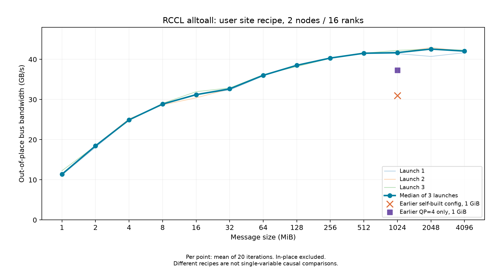

# 两节点 HCU BW1000_H / gfx936 / DTK26.10 RoCE RCCL all-to-all 现场配方

## 用途和结论

本条为 TrainFlow 自带 Wiki 的跨任务站点经验，正文和必要原件随工程提交。2026-10-10 UTC，在 110、76 两台空闲节点、各8卡的16-rank all-to-all，采用现场完整配方后，1/2/4 GiB out-of-place busbw 三次独立启动中位数为41.68/42.57/42.06 GB/s，最大42.94 GB/s。先前仅DTK自建配置1GiB中位30.99。历史44.83使用不同DTK/驱动且细节未齐，剩余约7%差距未消除，不当成严格同条件达标证明。用户后续指示继续模型工作与完整流程验证，历史比较保留未完成；原报告“等待优先级答复”是当时状态，现已由后续指导解除该执行阻塞。

## 环境与软件身份

| 项 | 本次条件 |
|---|---|
| 入口与节点 | SSH+Docker；测量10.32.4.110、10.32.4.76；host网络；任务容器trainflow-yuguo-kimi-k3 |
| 计算设备 | 每台8×BW1000_H，gfx936，80 CU；每卡65520 MiB可见VRAM；PCIe当前32GT/s×16 |
| 镜像 | 10.16.1.152:5000/jenkins/model_test_env/megatron:0.19.2-ubuntu22.04-dtk2610-py3.12-1009 |
| 镜像不可变ID | sha256:1861c9e3ac1384838486851a0696622ec53150ee624f270eb950d844d2b2e60d |
| 软件 | DTK26.10 / HIP7.2.26365；MPI5.0.3；Python3.12.12；Torch2.11.0+das.opt1.dtk2610.2609201632.gf74cd7 |
| 实际RCCL | librccl.so.1.0.3b793e3；SHA256 d97fb6832e86aa90d0a8505c4e417ff1ef3f842e77617c55172bd3c09879424d |
| 实际HIP动态库 | libgalaxyhip.so.5.2.26365.2328-0599bcb4；SHA256 e4ca400cbe6e68247ecccc61f1d86c3580596ea7ff492ce59a627fa94f5f796b；不能由库SONAME推测发行版 |
| Host内核 | 6.6.110-42.4.tl4.x86_64；HCU驱动/XDP模块证据另见原库存，不以容器DTK推定宿主驱动 |
| 网络 | 管理网eth0；RoCE mlx5_bond_0..3对应bond0..3，各bond两条200000Mbps物理从口；IEEE802.3ad LACP fast、layer3+4、MTU9100；GID index3，Ethernet ACTIVE |
| XDP | 两节点模块值14；前后已开，不是此次新增开关；RCCL GDR和实际路径以日志/库源码确认 |
| 测试源码与二进制 | rccl-test HEAD155f4748e6de7ce3ab54a0bf09931d9316262260；用户alltoall_perf SHA2564d087dab19bb500a127b2dfc0eda5657704c712104e744f4ce2e24bc231dc88d |
| 工作目录 | /cfs/yuguo/kimi-k3-pretrain；原件只读复制到任务目录，未改用户/cfs/env.sh及其测试目录 |

## 现场环境变量和加载顺序

每个rank先 `source /opt/dtk/env.sh`，再 `source /cfs/env.sh`。此次任务容器使用逐字节相同、固定哈希的site-env.sh副本，SHA256为94a4cbb4a3595f3969cc51603e213b7d868625514b91dad1f0cb8cd9fc95bee1。不要用 `bash /cfs/env.sh` 或传入apt参数：原脚本这两种方式还会改apt源，本实验未触发。

```bash
export NCCL_SOCKET_IFNAME=eth0
export GLOO_SOCKET_IFNAME=eth0
export NCCL_IB_GID_INDEX=3
export NCCL_IB_DISABLE=0
export NCCL_NET_GDR_LEVEL=2
export NCCL_IB_QPS_PER_CONNECTION=4
export NCCL_IB_TC=160
export NCCL_IB_TIMEOUT=22
export NCCL_ROCE_SRC_PORT_LIST=60000,60051,57663,57804
export RCCL_MODEL_MATCHING_DISABLE=1
export HSA_FORCE_FINE_GRAIN_PCIE=1
export NCCL_PXN_DISABLE=1
export NCCL_ALGO=Ring
```

以上为本次有效通信部分，不是所有HCU集群通用默认。原脚本还条件加载/opt/dtk/rccl/patch/fix_topo.xml及fix_graph.xml；两文件在本镜像均不存在，因此未标为已加载。实际/tmp/topo.xml的路径和各节点哈希保留原件。不另加NCCL_IB_HCA限制，HCA顺序由真实verbs枚举确认。未设置的环境变量不能简单等同功能关闭。GDR_LEVEL=2的当前源码语义为PXB，跨版本须复核。

## 命令与执行差异

用户原命令和完整执行argv见下方固定报告/计划。核心是16ranks、hostfile每节点slots=8、`-bind-to none -map-by slot`、`--mca coll_hcoll_enable 0 --mca pml ob1 --mca btl_tcp_if_include eth0 --mca btl ^openib`，各rank依次加载两脚本后运行原alltoall_perf，参数 `-b 1M -e 4G -f 2 -g 1`。

原hostfile节点67/93有显存占用，未抢用；改为空闲110/76。用户SSH端口12333对应原入口，本次任务专属SSH28476替代，并针对MPI5/PRRTE核实实际参数。临时服务/密钥已回收，因此旧命令不能不经重建直接重跑。后续模型任务应使用自己的合法launcher/端口/hostfile，保持并核对通信配方，不复制他人凭据。每次启动前核查节点进程、FD、显存和利用率；两次新鲜观测仍不能代表外部网络独占。

## 计时、正确性与因果边界

原命令扫描1MiB至4GiB共13点，dtype 为 float（FP32），每 rank 一个 GPU；每点默认5次预热、20次计时迭代；独立启动3次。使用十进制GB/s的out-of-place busbw；不把平均所有消息量/placement的Avg带宽当最大值，不把algbw/物理网口线速混用。全部13点out错误数0，48rank正常退出；in-place源码关闭错误校验，N/A不等于其正确性已过。原始数据、每次结果和曲线均保留。

四个固定源端口共10368条成功日志；48rank都有实际生效证据，未见NCCL WARN。调用方可能忽略端口修改函数错误返回，因此不能只读环境或退出0；此次也核实了成功日志和bond两从口流量约50/50（最大50.0422%）。无法据此证明交换机QoS/PFC或单开关因果贡献。采集含INFO日志，不称正式无观测开销性能验收。

## 后续任务复用顺序

1. 先用本记录定位原件，核对实际设备/镜像/库/网卡/GID/脚本和训练启动环境是否一致；检查权限与新鲜设备准入。
2. 相同条件可先引用本次预期范围，但启动时确认每rank变量和实际加载库；现场值不替代新任务的健康/正确性证据。
3. 新站点、DTK/RCCL、NIC/交换策略、拓扑文件、规模/消息/模式变化须重新判断；不要把固定RoCE端口、GID、TC或ALGO无条件复制到其他集群。
4. 指标参考按本次观测日起7天复核（本次开发镜像与脚本仍会变动）；更早发生配置变化立即失配/复核。新记录保留旧证据，不覆盖历史成绩。
5. 回退采用任务局部不再source该配方、恢复已保存的原启动配置；不修改宿主驱动、交换机或他人文件。新任务中的模型E2E收益需单独验证。

## 大消息结果（out-of-place busbw）

| 每 rank 总消息量 | 启动1 GB/s | 启动2 GB/s | 启动3 GB/s | 三次中位数 GB/s |
| --- | ---: | ---: | ---: | ---: |
| 1 GiB | 41.44 | 41.68 | 42.25 | 41.68 |
| 2 GiB | 40.73 | 42.94 | 42.57 | 42.57 |
| 4 GiB | 41.66 | 42.06 | 42.32 | 42.06 |

这张表是三个独立 launch 的汇总，不是每次内部20次迭代的原始分布。全部消息量见结构化结果与曲线。当前结果可以作为同环境的有条件参考，不能设为任意集群的验收阈值。



## 仓内固定证据与复核入口

- [环境摘要](environment.json)、[证据清单](manifest.json)：明确来源、处理方式、哈希和观测时间。
- [全部结果](evidence/2026-10-10-rccl/results.json)、[CSV](evidence/2026-10-10-rccl/sweep.csv)、[现场脚本原件](evidence/2026-10-10-rccl/site-env.sh)、[源码/配方快照回执](evidence/2026-10-10-rccl/source-receipt.json)。脚本原件用于查阅；复用时按前文 source 模式核对，不能直接执行其中更换 apt 源的分支。
- [原调查报告](evidence/2026-10-10-rccl/original-investigation.txt) 保留当时尚待用户决定的历史状态，当前执行结论以前文为准。
- 第1轮：[rank0 完整输出](evidence/2026-10-10-rccl/run-1/rank-00.stdout)、[全部16 rank 原始回执和日志ZIP](evidence/2026-10-10-rccl/run-1/all-ranks.zip)、[ZIP成员哈希](evidence/2026-10-10-rccl/run-1/archive-members.json)、[实际MPI argv](evidence/2026-10-10-rccl/run-1/mpi-started.json)、[组完成回执](evidence/2026-10-10-rccl/run-1/group-result.json)。
- 第2轮：[rank0 完整输出](evidence/2026-10-10-rccl/run-2/rank-00.stdout)、[全部16 rank 原始回执和日志ZIP](evidence/2026-10-10-rccl/run-2/all-ranks.zip)、[ZIP成员哈希](evidence/2026-10-10-rccl/run-2/archive-members.json)、[实际MPI argv](evidence/2026-10-10-rccl/run-2/mpi-started.json)、[组完成回执](evidence/2026-10-10-rccl/run-2/group-result.json)。
- 第3轮：[rank0 完整输出](evidence/2026-10-10-rccl/run-3/rank-00.stdout)、[全部16 rank 原始回执和日志ZIP](evidence/2026-10-10-rccl/run-3/all-ranks.zip)、[ZIP成员哈希](evidence/2026-10-10-rccl/run-3/archive-members.json)、[实际MPI argv](evidence/2026-10-10-rccl/run-3/mpi-started.json)、[组完成回执](evidence/2026-10-10-rccl/run-3/group-result.json)。
- [实际动态库与哈希](evidence/2026-10-10-rccl/run-1/libraries-10.32.4.110.json)、[节点110物理网络](evidence/2026-10-10-rccl/run-1/physical-network-before-10.32.4.110.json)、[节点76物理网络](evidence/2026-10-10-rccl/run-1/physical-network-before-10.32.4.76.json)、[XDP](evidence/2026-10-10-rccl/run-1/xdp-10.32.4.110.json)。每轮两节点 before/after 计数器保存在同目录，可重算 bond 流量比例。

## 后续训练衔接

在模型 runner 中保留相同 DTK → 固定站点脚本的激活顺序，并确认未被后续脚本覆盖。该脚本注释写 DTK26.04，而这份记录实际测于 DTK26.10；旧注释不替代实测库身份。将通信条件变化写入新的任务上下文/实验记录，避免把通信配置、micro-batch、融合开关一起改变后笼统归因。继续阅读[通用通信排查方法](../../../docs/practices/communication-recipe.md)和[站点总览](README.md)。

## 源码语义证据

[固定源码摘录](evidence/2026-10-10-rccl/source-excerpts.json)保留文件完整SHA256、提交、行号和原文；[原源码复核](evidence/2026-10-10-rccl/source-review.json)补充默认参数与二进制旁源码比较。RCCL `paths.cc` 的旧数字等级映射将2映射为PXB；`net_ib.cc` 设置UDP源端口的错误由所示(void)调用丢弃，因此另查成功日志；`alltoall.cu`明确将in-place reportErrors关闭，带宽公式也在摘录中。源码提交/动态库后缀匹配并不证明可复现构建，本页同时保留运行时加载库及其字节哈希。
